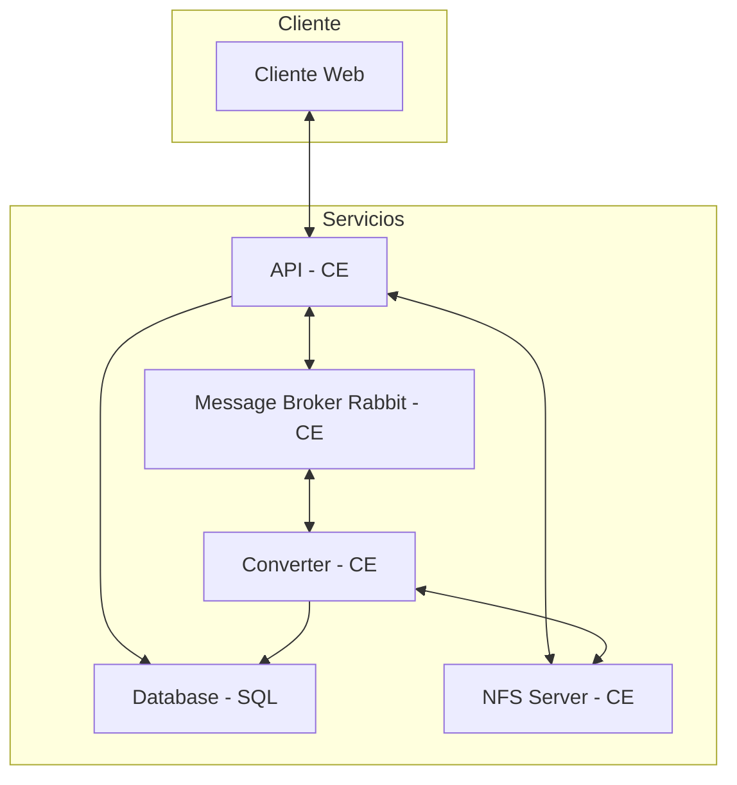
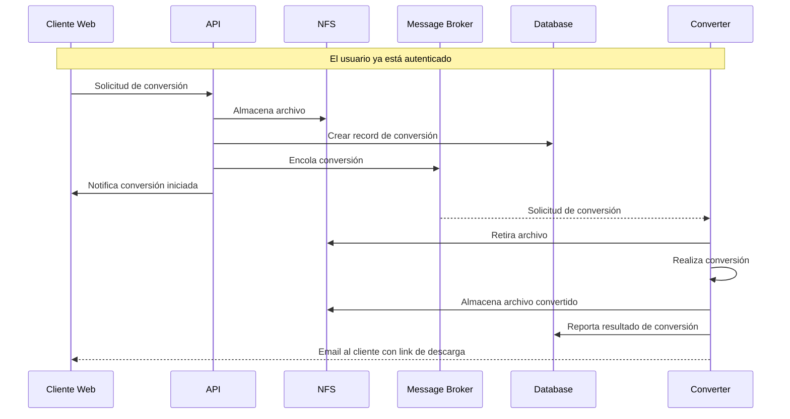
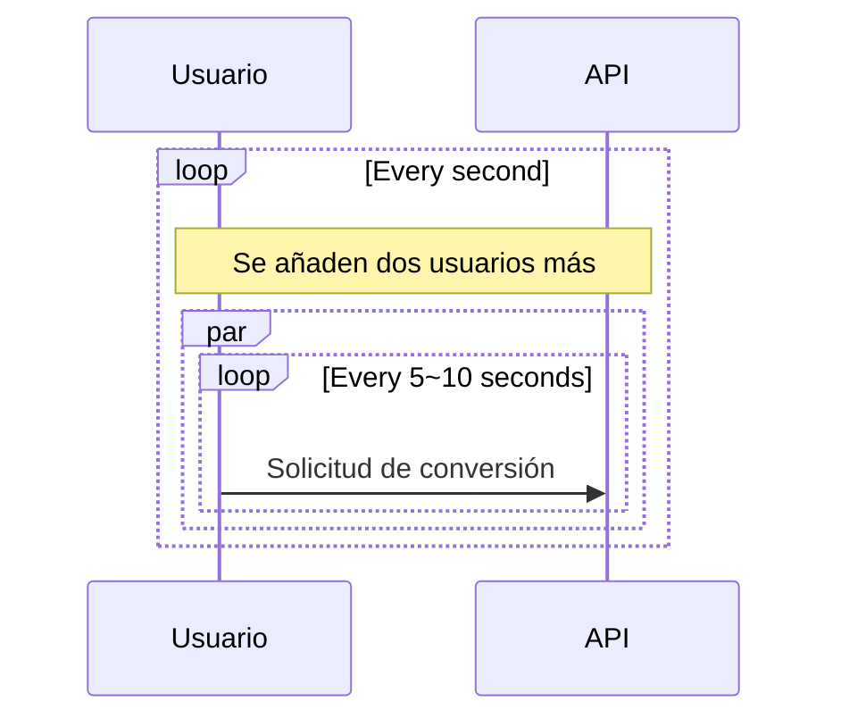
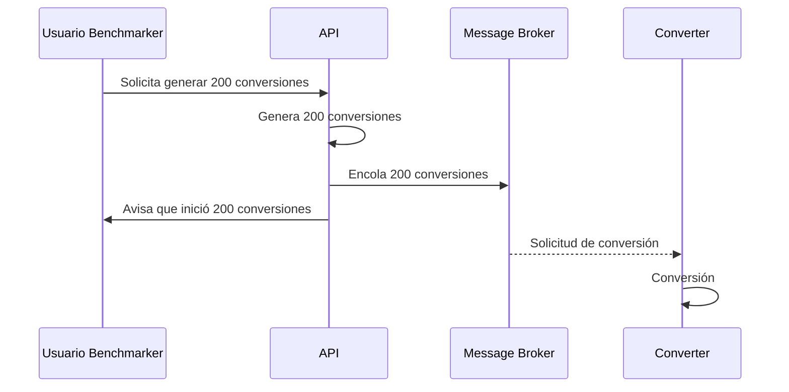

# Aplicación Cloud Convert

Aplicación que convierte archivos entre los siguientes formatos de audio: MP3, ACC, OGG, WAV, WMA

| Nombres   | Apellido   | Correo @uniandes               | Usuario de GitHub |
|-----------|------------|--------------------------------|-------------------|
| Ronald    | Lugo       | r.lugoq@uniandes.edu.co        | [@RonaldLugo]     |
| Alejandro | Santamaría | a.santamaria11@uniandes.edu.co | [@miso-alejosaur] |
| Hector    | Tenezaca   | h.tenezaca@uniandes.edu.co     | [@htenezaca]      |
| Javier    | López Grau | je.lopez816@uniandes.edu.co    | [@muniter]        |

## Objetivo

Desarrollar un servicio de conversión entre diferentes formatos de audio y poner a prueba su rendimiento y capacidad bajo unas características de infraestructura local definidas

## Arquitectura

Versión: **máquinas virtuales en GCP**

La siguiente es la arquitectura de la aplicación

Convención del diagrama:  
**CE**: Google Cloud Compute engine  
**SQL**: Google Cloud SQL  



### Componentes

A nivel de infraestructura

| Componente     | Propósito                                                            |
|----------------|----------------------------------------------------------------------|
| Cliente        | Consume el servicio de conversión.                                   |
| API            | Autentica, y despacha los servicios.                                 |
| Converter      | Recibe solicitudes de conversión                                     |
| NFS Server     | Provee carpeta común para transferir archivos entre converter y api  |
| Message Broker | Cola de mensajería, por donde se despachan solicitudes de conversión |
| Database       | Persistencia de usuarios, tasks, metadata de conversiones            |

Nota: el alcance actual no incluye el desarrollo del cliente web, por lo cual en este alcance se usa Postman para simular las peticiones que realizaría el cliente web

### Tecnológica

Se utiliza docker para orquestar el levantamiento de los cuatro componentes.

1. Postgres: motor de base de datos relacional.
2. Flask: web framework.
3. Rabbit MQ: cola de mensajería
3. Celery: framework que utiliza a Rabbit para implementar un job queue.
4. SqlAlchemy: ORM para la comunicación.
5. uvicorn: HTTP <-> ASGI bridge para la comunicación del Flask.
6. ffmpeg: convertidor de formatos de audio.
7. nfs: network file system, transfiere archivos en la red.

### Ejemplo de conversión



### Endpoints implementados
| Endpoint                      | Método | Descipción                                     | Parámetros                                                                              | Consideraciones                                                                                                                                                                                                                               |
|-------------------------------|--------|------------------------------------------------|-----------------------------------------------------------------------------------------|-----------------------------------------------------------------------------------------------------------------------------------------------------------------------------------------------------------------------------------------------|
| `/api/auth/signup`            | POST   | Creación de cuenta de usuario                  | <ul><li>username</li><li>password1</li><li>password2</li><li>email</li></ul>            | <ul><li>Usuario y correo electrónico son únicos en el sistema</li><li>Password entre 5 a 20 caracteres, debe contener al menos una minúscula, una mayúscula, un número, un caracter especial [$#@], y no tener espacios/tabs/saltos</li></ul> |
| `/api/auth/login`             | POST   | Login que recupera token de autorización       | <ul><li>username</li><li>password</li></ul>                                             | <ul><li>El token retornado debe ser usado en funcionalidades que requieran autorización</li></ul>                                                                                                                                             |
| `/api/tasks`                  | GET    | Recupera todas las tareas de conversión        | <ul><li>Header Authorization: Bearer Token</li></ul>                                    |                                                                                                                                                                                                                                               |
| `/api/task`                   | POST   | Crea una nueva tarea de conversión de formatos | <ul><li>Header Authorization: Bearer Token</li><li>fileName</li><li>newFormat</li></ul> | <ul><li>Formatos permitidos: "mp3", "acc", "ogg", "wav", "wma"</li></ul>                                                                                                                                                                      |
| `/api/tasks/<int:id_task>`    | GET    | Recupera una tarea específica de conversión    | <ul><li>Header Authorization: Bearer Token</li></ul>                                    | <ul><li>id_task: id de tarea existente</li></ul>                                                                                                                                                                                              |
| `/api/tasks/<int:id_task>`    | PUT    | Actualiza una tarea de conversión existente    | <ul><li>Header Authorization: Bearer Token</li><li>newFormat</li></ul>                  | <ul><li>id_task: id de tarea existente</li><li>Formatos permitidos: "mp3", "acc", "ogg", "wav", "wma"</li></ul>                                                                                                                               |
| `/api/tasks/<int:task_id>`    | DELETE | Elimina una tarea de conversión existente      | <ul><li>Header Authorization: Bearer Token</li></ul>                                    | <ul><li>id_task: id de tarea existente</li></ul>                                                                                                                                                                                              |
| `/api/files/<string:file_id>` | GET    | Descarga de archivo                            | <ul><li>Header Authorization: Bearer Token</li></ul>                                    | <ul><li>id_task: id de tarea existente</li></ul>                                                                                                                                                                                              |

Información adicional en documentación del API en Postman en el siguiente link: [documentación API](https://documenter.getpostman.com/view/23989156/2s84LF4Gow), también puede usar [el archivo JSON que describe la API](./collections/Api.postman_collection.json)
- Configurar environment con las siguientes variables:
  - protocol: http
  - host: \<\<IP_MAQUINA_VIRTUAL_APP\>\>:8000

## Instrucciones Generales de despliegue

### Inicializar máquina virtual

Requerimientos:
- Máquina virtual de despliegue
  - Hypervisor: VirtualBox
  - Capacidad: 2Gb ram, 1 vCPU, 30 Gb
    - Nota: más adelante en el análisis de capacidad se brinda detalles acerca de las razones para establecer esta configuración como predeterminada
  - Nombre: app_uni_cloud_convert
  - Tipo: Linux
  - Versión: Ubuntu (64-bit)
  - Tipo de adaptador de red: adaptador puente
    - Nota: se opta por adaptador puente para facilitar la comunicación entre máquinas virtuales a través del mismo segmento de red
- Software a instalar
  - Ubuntu server 20.04 LTS o superior
    - Git: ya incluido con la imágen Ubuntu
    - OpenSSH server: incluir su instalación durante el proceso de instalación de Ubuntu
  - Docker
    - Seleccionar package Docker durante el proceso de instalación de Ubuntu
- Parámetros del SO
  - Nombre: User Linux
  - Nombre de servidor: appunicloudconvert
  - username: userlinux
  - password: \<\<PASS\>\>
- Configuraciones post
  - Instalar utilidades de red
    - ```sudo apt install net-tools```
  - Consultar ip
    - ```ifconfig```

### Despliegue

```bash
# 1. Clonar repositorio
git clone https://github.com/muniter/uni_cloud_convert.git
# 2. Entrar a carpeta
cd uni_cloud_convert
# 3. Levantar aplicación
sudo docker compose up
```

Levantar todo en docker puede tomar unos minutos mientras se descargan las imágenes, será claro que ya está corriendo cuando se vean la cantidad de logs del sistema.


### Destruir / Tear Down

Lo siguiente parará (si están corriendo) los contenedores, los elimina y también elimina los volúmenes. De tal forma que al levantar de nuevo el aplicativo empieza en blanco.

```bash
# Se eliminan los volúmenes y también los archivos
# que se han recibido para conversión
sudo docker compose down -v && sudo rm -rf ./assets/*
```

### Health Checks

Para confirmar el funcionamiento de las partes de la app:

```bash
# Cliente Web (En el response se verá el resultado)
curl localhost:8000/api-health
# Converter (Revisar los logs para ver el resultado)
curl localhost:8000/converter-health
# Ping, pong style (mirar los logs)
curl localhost:8000/ping
```

### Comandos frecuentes
```bash
# Rendimiento de la máquina virtual
top
# Rendimiento de containers
sudo docker stats
# Containers en ejecución
sudo docker container ls 
# conectarse a un container en particular con bash 
sudo docker exec -it <<containerid>> bash
```

### Prueba del servicio
- Habilitar envío de notificación por correo electrónico
  ```bash
  # uni_cloud_convert / .env 
  STRESS_TEST=0
  ```
- Reiniciar contenedores desde cero
  ```bash
  sudo docker compose down -v && sudo rm -rf ./assets/*
  ```
- Levantar aplicación
  ```bash
  sudo docker compose up
  ```
- 1 - Signup - /api/auth/signup
  - ingresar usuario, password y email de notificación
- 2 - Login - /api/auth/login
  - ingresar usuario y password. Capturar \<\<TOKEN DE AUTORIZACIÓN\>\> y \<\<TASK ID\>\>
- 4 - Create task - /api/tasks:  
  - actualizar Header / Authorization: Bearer \<\<TOKEN DE AUTORIZACIÓN\>\>
  - seleccionar archivo y formato de conversión deseado
- 3 - Get all tasks - /api/tasks
  - actualizar Header / Authorization: Bearer \<\<TOKEN DE AUTORIZACIÓN\>\>
  - verificar tarea creada
- 5 - Get task - /api/tasks/\<id\>
  - actualizar Header / Authorization: Bearer \<\<TOKEN DE AUTORIZACIÓN\>\>
  - Reemplazar \<id\> con \<\<TASK ID\>\>
  - Verificar estado de la tarea en *processed*
  - Verificar recepción de correo de notificación - identificar archivo de descarga \<\<FILENAME\>\>
    - Reemplazar en el link *localhost* con la \<\<IP MAQUINA VIRTUAL APP\>\>
- 8 - Download file - /api/files/\<filename\>
  - actualizar Header / Authorization: Bearer \<\<TOKEN DE AUTORIZACIÓN\>\>
  - Reemplazar \<\<FILENAME\>\>
  - Confirmar descarga del archivo convertido
- 6 - Change format - /api/tasks/\<id\>
  - actualizar Header / Authorization: Bearer \<\<TOKEN DE AUTORIZACIÓN\>\>
  - Reemplazar \<id\> con \<\<TASK ID\>\>
  - Ingresar newFormat con el formato deseado
- Repetir pasos 3 y 5 para confirmar la actualización de la tarea y el estado *processed*
  - Verificar recepción de correo de notificación
- 7 - Delete task - /api/tasks/\<id\>
  - actualizar Header / Authorization: Bearer \<\<TOKEN DE AUTORIZACIÓN\>\>
  - Reemplazar \<id\> con \<\<TASK ID\>\>
- Repetir pasos 3 y 5 para confirmar la eliminación de la tarea

<div style="page-break-after: always; visibility: hidden"> 
</div>

# Análisis de Capacidad

Se realizan pruebas de carga y estrés a la aplicación para lograr dimensionar la capacidad de la misma en un entorno de infraestructura definido. A continuación se describen las pruebas realizadas, los análisis de los resultados y las conclusiones sobre el rendimiento de la aplicación

## Inicializar máquina virtual de prueba

Requerimientos:
- Máquina virtual de despliegue
  - Hypervisor: VirtualBox
  - Capacidad: 2Gb ram, 1 vCPU, 10 Gb
  - Nombre: tests_uni_cloud_convert
  - Tipo: Linux
  - Versión: Ubuntu (64-bit)
  - Tipo de adaptador de red: adaptador puente
    - Nota: se opta por adaptador puente para facilitar la comunicación entre máquinas virtuales a través del mismo segmento de red
- Software a instalar
  - Ubuntu server 20.04 LTS o superior
    - Git: ya incluido con la imágen Ubuntu
    - OpenSSH server: incluir su instalación durante el proceso de instalación de Ubuntu
- Parámetros del SO
  - Nombre: User Linux
  - Nombre de servidor: testsunicloudconvert
  - username: userlinux
  - password: \<\<PASS\>\>
- Configuraciones post
  - Instalar utilidades de red
    - ```sudo apt install net-tools```
  - Instalar pip
    - ```sudo apt install python3-pip```
  - Consultar ip
    - ```ifconfig```

## Preámbulo

### Hallazgos en instalación de Máquinas virtuales

El proceso de preparación de máquinas virtuales para despliegue y pruebas permitió identificar la configuración predeterminada plasmada. A continuación se comparten los hallazgos más relevantes, los cuales motivaron la definición de parámetros sugeridos:

- Memoria: La configuración sugerida inicialmente era 1Gb de RAM, sin embargo, docker (componente adicional del sistema) consume 700Mb. 
  - Por este motivo, se sugiere la configuración predeterminada en 2Gb de RAM
- Almacenamiento: La configuración sugerida inicialmente era de 10Gb de almacenamiento, sin embargo, Ubuntu Server consume alrededor del 90% del disco, dejando disponibles menos de 1Gb para la operación del servicio. 
  - El comportamiento con una configuración de 10Gb fue el siguiente:
    - Uso del servicio: satisfactorio. El consumo del API y las funcionalidades de la aplicación se logran realizar correctamente
    - Escenarios de carga y estress: falla del sistema
      - Los escenarios de carga y estress se modelaron con archivos de 5Mb, por lo cual una prueba estándar de 100 peticiones genera como mínimo 710Mb de almacenamiento de archivos (500Mb de archivos cargados + 210Mb de archivos convertidos)
      - Teniendo en cuenta la limitante de almacenamiento (menor a 1Gb), correr un escenario de carga y estress provoca fallas en el sistema por falta de capacidad en almacenamiento
      - Cuando sucede la falla, se identifica el siguiente comportamiento en los componentes:
        - Rabbit-mq: inicialmente arroja una alerta indicando que no hay espacio suficiente en disco; posteriormente arroja un error y el contenedor específico se cierra abrutamente 
        - Converter: pierde conexión a la cola de mensajería, sin embargo, continua operando
        - Postgresql: arroja alertas por capacidad de disco, intenta reiniciar el servicio de bd periódicamente, sin embargo, continua operando
        - Api: continua operando
  - Para efectos de lograr generar escenarios de carga y estress que permitieran poner a prueba todos los componentes de la aplicación, se sugiere la configuración predeterminada de 30Gb de almacenamiento
- Procesamiento: Se mantiene la configuración sugerida de 1vCPU. En los escenarios no se observa saturación o desbordamiento de capacidad
  - Nota informativa: como laboratorio se intentó configurar una máquina virtual con 2vCPU en VirtualBox con Ubuntu, sin embargo el proceso de instalación del SO no finaliza correctamente con esta configuración y al reiniciar no levanta los servicios correctamente. Al no tener un impacto relevante para las pruebas de la aplicación, solo se identifica el hallazgo y se continua el uso de 1vCPU

## Escenarios del Plan de pruebas

### 1. Capacidad de solicitudes

Máxima cantidad de request/minuto que soporta la aplicación con usuario concurrentes.

Este escenarios es de vital importancia para el aplicativo, nos permitirá conocer la cantidad de request que podremos atender en una ventana de tiempo manteniendo un nivel de servicio aceptable. En este caso consideramos que una media de 1.5 segundos y perdidas menores del 1% son acciones representativas en la operación.

Limitantes:

- Archivo de tamaño mínimo de 5MB
- Tiempo de respuesta aceptable de 1.5 segundos
- Porcentaje de error máximo del 1%
- Error de timeout si una respuesta demora más de 10 segundos

#### Detalle de operación

La prueba se realiza enviando requests concurrentes al endpoint de crear tareas, `/api/tasks` con un archivo de 5MB. Los request se presentan de la siguiente manera:

- El benchmark cuenta con usuarios
- Empieza con 2 usuarios
- Los usuarios envian un request entre 5 a 10 segundos de manera aleatoria.
- Cada segundo que pasa se añaden 2 nuevos usuarios.
- Usuarios máximos: 400

> Vista **simplificada del proceso**: aunque no estén dibujados en el diagrama todo está operando en conjunto, se encola, se guarda en db y el convertidor trabaja.



#### Instrucciones

Debe haber seguido antes las [Insrucciones Generales](#instrucciones-generales) para inicializar en al parte superior del documento.

- Deshabilitar el envío de notificación por correo electrónico en la máquina donde está corriendo la aplicación appunicloudconvert
    ```bash
    # uni_cloud_convert / .env 
    STRESS_TEST=1
    ```
- Reiniciar contenedores desde cero en appunicloudconvert
    ```bash
    sudo docker compose down -v && sudo rm -rf ./assets/*
    ```
- Levantar aplicación
  ```bash
  sudo docker compose up
  ```
1. Instalar locust en máquina virtual testsunicloudconvert:
    ```bash
    pip install locust
    ```

2. Obtener **IP de la máquina virtual donde esta corriendo la aplicación.** (máquina virtual appunicloudconvert)
    ```bash
    ifconfig
    ``` 

2. Obtener **IP de la máquina virtual donde esta corriendo el test.** (máquina virtual testsunicloudconvert)
    ```bash
    ifconfig
    ``` 

3. Copiar archivo locustfile.py y sample.mp3 del repositorio y ubicarlos en el directorio desde donde se ejecutará locust

4. Iniciar locust en testsunicloudconvert

    ```bash
    # NOTA: reemplazar por la IP_DE_MAQUINA_VIRTUAL_APP
    locust --host=http://IP_DE_MAQUINA_VIRTUAL_APP:8000 --users=400 --spawn-rate=2 --autostart
    ```

4. Navegar a `http://IP_DE_MAQUINA_VIRTUAL_TEST:8089` para ver la interfaz de locust podrá ver tab de **estadisticas, gráficas e instrucciones**.

#### Resultados

El informe de resultados [se puede ver en su totalidad en la siguiente página][@res-scenario-1]

Estos son los puntos principales:
- El aplicativo es capaz de mantener un tiempo de respuesta menor a 1.5 segundos con 70 usuarios concurrentes, atendiendo a 7.4 request/segundo.
- El aplicativo es capaz de atender 440 request/minuto con archivos para conversión.
- El aplicativo se satura fuertemente a los 110 usuarios concurrentes con una respuesta media de 3.7 segundos.
- El aplicativo comienza a tener errores de timeout (request con más de 10 segundos de demora) con 170 usuarios concurrentes.

Durante la operación en punto crítico esta era la utilización de recursos:

> *obtenida con `docker stats`*

| CONTAINER ID | NAME      | CPU %   | MEM USAGE / LIMIT   | MEM %  | NET I/O         | BLOCK I/O       | PIDS |
|--------------|-----------|---------|---------------------|--------|-----------------|-----------------|------|
| 1e8053e774a9 | api       | 74.14%  | 147.7MiB / 1.929GiB | 7.48%  | 1.82GB / 3.39MB | 50.4MB / 4.29GB | 3    |
| e28e11546b38 | converter | 111.86% | 308.4MiB / 1.929GiB | 15.61% | 90.4kB / 59.9kB | 403MB / 746MB   | 21   |
| 75e643db542e | rabbit-mq | 0.77%   | 110.3MiB / 1.929GiB | 5.58%  | 329kB / 94.7kB  | 101MB / 2.4MB   | 26   |
| 802a21b1240c | database  | 1.72%   | 44.35MiB / 1.929GiB | 2.24%  | 774kB / 707kB   | 90.7MB / 117MB  | 13   |

A partir de esto:
- El aplicativo se encuentra principalmente restringido por la capacidad de procesamiento (CPU)
- El convertidor es el mayor consumidor de CPU
- El mayor consumidor de memoria es el convertidor
- Debido a la alta carga de request el API toma recursos que necesita el converter, haciendo lento su trabajo.
- Los componentes rabbit y database por estar escritos en lenguajes low level son mucho más eficiente en uso de recursos.

### 2. Capacidad de conversiones

Máxima cantidad de archivos procesables por minuto.

Este escenarios es de vital importancia para el aplicativo, nos permitirá conocer la cantidad de conversiones que podremos atender por parte de los usuarios, teniendo un tiempo de demoras aceptable de 10 minutos.

Limitantes:

- Archivo de tamaño mínimo de 5MB
- Tiempo de conversión (desde la solicitud hasta que el convertidor lo procesa) máximo de 10 minutos.

#### Detalle de operación

La prueba se realiza enviando un request a un endpoint especial `/benchmark/conversion/start` con un archivo de 5MB, el formato esperado y el número de tareas a ejecutar. El proceso funciona de la siguiente manera:

- El usuario benchmark (tú) hace el llamado a la api para iniciar el benchmark con un archivo (mp3 de 5MB), nuevo formato (wav) y número de tareas (200).
- El api genera los artefactos en base de datos y file system para las 200 tareas.
- El api encola las 200 tareas rápidamente
- El convertidor desencola y convierte

> Vista **simplificada del proceso**: aunque no estén dibujados en el diagrama todo está operando en conjunto, se encola, se guarda en db y el convertidor trabaja.



#### Resultados

**Estado del sistema**

Docker stats

| CONTAINER ID | NAME      | CPU %   | MEM USAGE / LIMIT  | MEM %  | NET I/O       | BLOCK I/O       | PIDS |
|--------------|-----------|---------|--------------------|--------|---------------|-----------------|------|
| de76416b2310 | converter | 273.11% | 470.9MiB / 1.93GiB | 23.83% | 309kB / 251kB | 1.37GB / 6.05GB | 21   |
| a088a7065d76 | api       | 0.05%   | 113.1MiB / 1.93GiB | 5.72%  | 5.9MB / 879MB | 6.62MB / 10.6GB | 3    |
| bd8dce77cacf | rabbit-mq | 0.72%   | 104.9MiB / 1.93GiB | 5.31%  | 501kB / 277kB | 29.2MB / 25.2MB | 26   |
| cf3c71fa7a20 | database  | 0.33%   | 48.67MiB / 1.93GiB | 2.46%  | 613MB / 606MB | 52.4MB / 117MB  | 14   |

Top


Tiempo promedio de procesamiento por archivo: 15 segs


Resultado general:


Resultado particular:


Los resultados más relevantes son: 
- Comportamiento de componentes son:
  - El componente **converter** tiene el mayor consumo de cpu y memoria, producto de la conversión de archivos realizada
  - El componente **rabbit-mq** no genera un alto consumo de recursos para gestionar la distribución de carga de las 400 peticiones encoladas
  - El componente **database** no genera alto consumo de recursos a pesar que cada procesamiento es actualizado en el sistema
  - El componente **api** genera alto consumo de I/O para el paso de archivos, pero su carga baja durante la fase de procesamiento
  - El comportamiento del procesamiento fue consistente en cuanto a tiempos, en promedio cada conversión tardó alrededor de 15 segundos
- Procesamiento para 400 solicitudes simultáneas:
  - Cantidad de archivos procesados en menos de 10 min: 193
  - Cantidad de archivos procesados en más de 10 min: 207
  - La cantidad mínima de archivos procesados por minuto fueron: 15
  - La cantidad máxima de archivos procesados por minuto fueron: 20
  - La tendencia del sistema fue procesar hasta 20 archivos por minuto con leves intermitencias
  - El tiempo que tardó el sistema en procesar las 400 solicitudes fue de 21 minutos

**Archivos procesados por minuto: 20**

#### Instrucciones

Debe haber seguido antes las [Insrucciones Generales](#instrucciones-generales) para inicializar en al parte superior del documento.

- Deshabilitar el envío de notificación por correo electrónico en la máquina donde está corriendo la aplicación appunicloudconvert
    ```bash
    # uni_cloud_convert / .env 
    STRESS_TEST=1
    ```
- Reiniciar contenedores desde cero
    ```bash
    sudo docker compose down -v && sudo rm -rf ./assets/*
    ```
- Levantar aplicación
  ```bash
  sudo docker compose up
  ```
1. Obtener **IP de la máquina virtual donde esta corriendo la aplicación.**

2. Enviar request para iniciar benchmark:

    ```bash
    curl -F fileName=@sample.mp3 -F newFormat=wav -F taskNumber=400 http://IP_DE_MAQUINA_VIRTUAL:8000/benchmark/conversion/start
    ```

3. Copiar localmente la carpeta **reporte** del repositorio, modificar la primera línea del archivo **report.js**
    ```bash
    http://IP_DE_MAQUINA_VIRTUAL:8000/benchmark/conversion/data
    ```

4. Ejecutar index.html y monitorear durante 10 minutos para poder observar cuantas tareas se pudieron completar, y posteriormente para identificar cuando se completen las 400 peticiones

4. Obtener datos de procesamiento de todos las tareas para luego ser analizadas en detalle:

> Nota: **require el comando jq para procesar el json**

  ```bash
  curl http://IP_DE_MAQUINA_VIRTUAL:8000/benchmark/conversion/result | jq -r 'sort_by(.id) |  .[] | [.id, .uploaded_at, .processed_at] | @csv' > ./stats.csv
  ```

5. Un ejemplo del reporte es el siguiente:[html](https://muniter.github.io/uni_cloud_convert/local_scenario_2), [pdf](https://github.com/muniter/uni_cloud_convert/wiki/Entrega-1---pdfs)

### Limitaciones

- Python y su framework flask no son ideales para aplicaciones intensivas como la transferencia de grandes cantidades de datos (subir archivos)
- Python y sus utilidades de transformación nos son ideales para actividades que están fuertemente restringidas por el uso de recursos (conversión de archivos).


### Conclusiones
- El uso de git y docker optimiza el proceso de desarrollo colaborativo, simplifica el proceso de despliegue en la máquina virtual y estandariza el despliegue en pro de un comportamiento similar en diferentes máquinas virtuales 
- La capacidad de almacenamiento es un factor muy relevante en el funcionamiento del servicio ya que se almacena cada archivo cargado en su versión original y en su versión convertida. Para proyectar un escalamiento a cientos de usuarios finales se recomienda considerar lo siguiente:
- Definir tamaños máximos de archivos y estimar la capacidad máxima esperada de peticiones de carga, de tal manera que se pueda estimar cual es la capacidad de almacenamiento límite a la que podría llegar el sistema
- Separar el almacenamiento de los componentes de docker al almacenamiento de archivos de audio, de tal manera que la indisponibilidad de capacidad de almacenamiento de archivos, no afecte el funcionamiento del componente del servicio
- El uso de colas de mensajería permite desacoplar las dependencias de la respuesta del api frente al procesamiento de archivos, favoreciendo una mejor gestión y respuesta al usuario
- Las limitaciones en la infraestructura donde opera el sistema, afecta directamente los tiempos de respuesta, la cantidad de transacciones concurrentes y la velocidad en que se completa un proceso de conversión


<!-- links, leave at the end, this should be invisible -->
[@RonaldLugo]: https://github.com/RonaldLugo
[@miso-alejosaur]: https://github.com/miso-alejosaur
[@htenezaca]: https://github.com/htenezaca
[@muniter]: https://github.com/muniter
[@res-scenario-1]: https://muniter.github.io/uni_cloud_convert/local_scenario_1


# Pasos

1. Instalar paquetes necesarios

```bash
sudo apt update && sudo apt install docker docker-compose nfs-common git
```

1. Configurar permisos para docker

```bash
sudo usermod -aG docker $USER
```

1. Cerrar sesión y conectarse de nuevo para que tome los nuevos permisos.

Verificar que todo funciona con el comando:

```bash
docker ps
```

1. Clonar el repositorio

```bash
git clone https://github.com/muniter/uni_cloud_convert.git
```

1. Cambiar a la carpeta esperada

1. Levantar servicio con el script

```bash
sudo ./startup.py
```

## Hallazgos Cloud

El convertidor por defecto estaba usando 5 workers, lo que resultó demasiado para los recursos de la máquina, por lo cual tocó retornar a la configuración por defecto de celery que es 1 woker/cpu.
