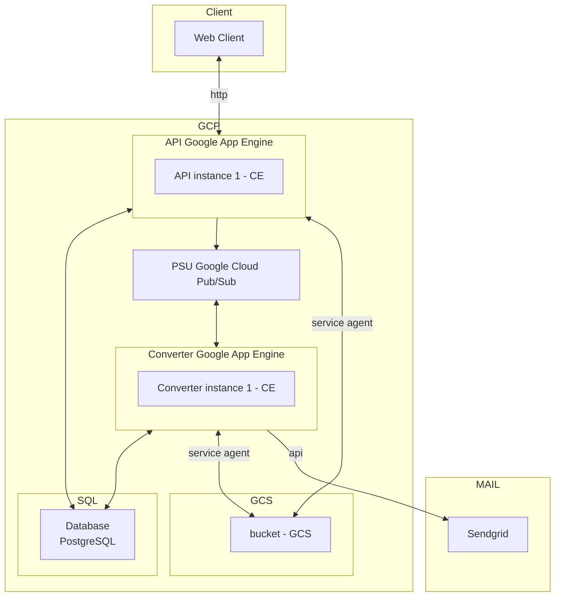
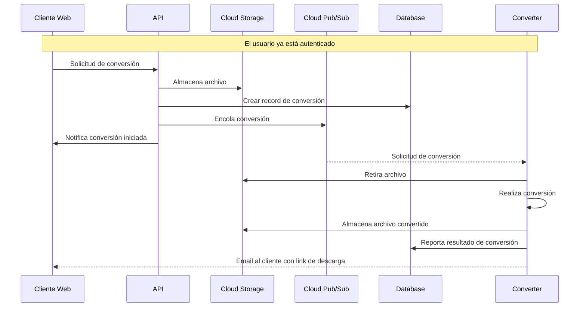
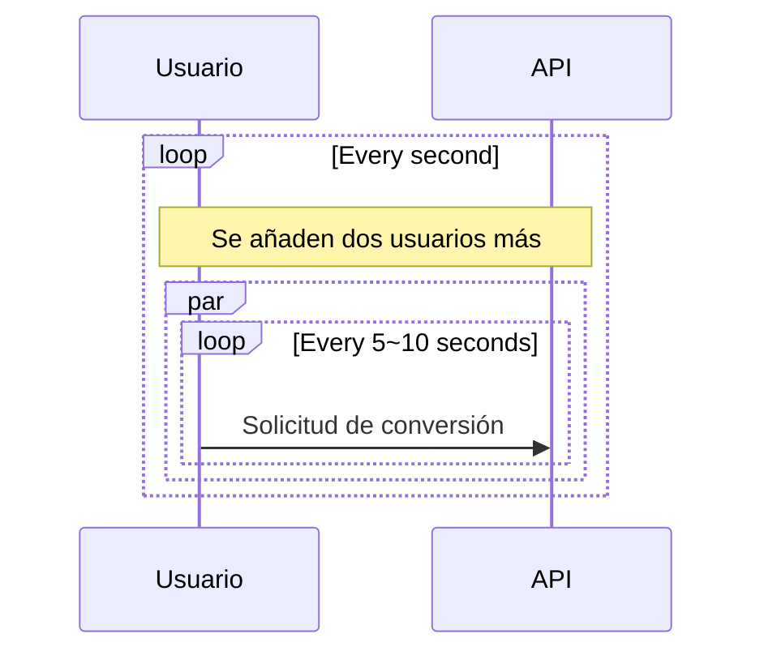
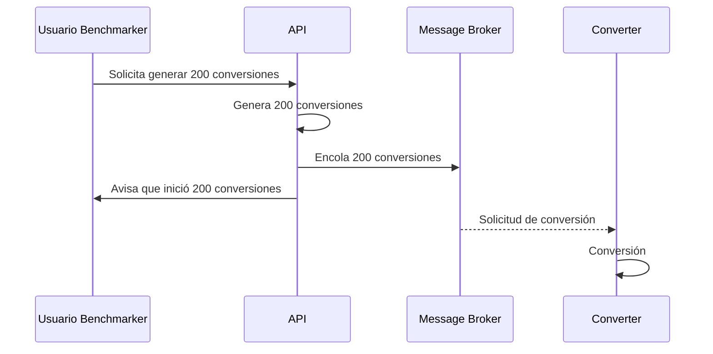

# Aplicación Cloud Convert

Aplicación que convierte archivos entre los siguientes formatos de audio: MP3, ACC, OGG, WAV, WMA

| Nombres   | Apellido   | Correo @uniandes               | Usuario de GitHub |
|-----------|------------|--------------------------------|-------------------|
| Ronald    | Lugo       | r.lugoq@uniandes.edu.co        | [@RonaldLugo]     |
| Alejandro | Santamaría | a.santamaria11@uniandes.edu.co | [@miso-alejosaur] |
| Hector    | Tenezaca   | h.tenezaca@uniandes.edu.co     | [@htenezaca]      |
| Javier    | López Grau | je.lopez816@uniandes.edu.co    | [@muniter]        |

## Objetivo

Desarrollar un servicio de conversión entre diferentes formatos de audio y poner a prueba su rendimiento y capacidad bajo unas características de infraestructura local definidas

* alcance entrega 5: despliegue en PaaS - Google App Engine

## Arquitectura

Versión: **app desplegada en plataforma PaaS - Google App Engine**

La siguiente es la arquitectura de la aplicación

Convención del diagrama:  
**GCP**: Google Cloud Platform  
**CE**: Google Cloud Compute engine  
**SQL**: Google Cloud SQL  
**LB**: Load Balancer  
**MIG**: Google App Engine  
**PSU**: Google Cloud Pub/Sub  
**GCS**: Google Cloud Storage  



### Componentes

A nivel de infraestructura

| Componente        | Propósito                                                                 |
|-------------------|---------------------------------------------------------------------------|
| Client            | Consume el servicio de conversión.                                        |
| Google App Engine | Habilita el environment, expone un dns de consumo, administra internamente temas como el balanceo de carga, las instancias de despliegue y el escalamiento (de acuerdo a la configuración establecida) |
| API               | Autentica, y despacha los servicios.                                      |
| Cloud Pub/Sub     | Servició de mensajería, por donde se despachan solicitudes de conversión  |
| Converter         | Recibe solicitudes de conversión                                          |
| Bucket            | Almacenamiento común de transferencia de archivos para converter y api    |
| Database          | Persistencia de usuarios, tasks, metadata de conversiones                 |
| Mail              | Servicio para el envío de email de notificación de conversión finalizada  |

*Nota: el alcance actual no incluye el desarrollo del cliente web, por lo cual en este alcance se usa Postman para simular las peticiones que realizaría el cliente web*

### Tecnológica

Se utiliza docker para orquestar el levantamiento del componente Converter

#### Tecnologías

1. Postgres: motor de base de datos relacional.
2. Flask: web framework.
3. Cloud Pub/Sub: sistema de mensajería asíncrona.
4. SqlAlchemy: ORM para la comunicación.
5. uvicorn: HTTP <-> ASGI bridge para la comunicación del Flask.
6. ffmpeg: convertidor de formatos de audio.
7. Google Cloud storage: Almacenamiento de archivos.
8. Load Balancer: balanceador de carga de peticiones HTTP.
9. Google App Engine: entorno administrado tipo PaaS para el despliegue de aplicaciones

#### Servicios de Google Cloud Platform utilizados

1. Google App Engine
2. Compute Engine
3. SQL
4. Cloud Storage
5. Monitoring
6. Pub/Sub

### Ejemplo de conversión

Este es el flujo normal que ocurre cuando un usuario crea una tarea de conversión.



### Endpoints implementados

| Endpoint                      | Método | Descipción                                     | Parámetros                                                                              | Consideraciones                                                                                                                                                                                                                               |
|-------------------------------|--------|------------------------------------------------|-----------------------------------------------------------------------------------------|-----------------------------------------------------------------------------------------------------------------------------------------------------------------------------------------------------------------------------------------------|
| `/api/auth/signup`            | POST   | Creación de cuenta de usuario                  | <ul><li>username</li><li>password1</li><li>password2</li><li>email</li></ul>            | <ul><li>Usuario y correo electrónico son únicos en el sistema</li><li>Password entre 5 a 20 caracteres, debe contener al menos una minúscula, una mayúscula, un número, un caracter especial [$#@], y no tener espacios/tabs/saltos</li></ul> |
| `/api/auth/login`             | POST   | Login que recupera token de autorización       | <ul><li>username</li><li>password</li></ul>                                             | <ul><li>El token retornado debe ser usado en funcionalidades que requieran autorización</li></ul>                                                                                                                                             |
| `/api/tasks`                  | GET    | Recupera todas las tareas de conversión        | <ul><li>Header Authorization: Bearer Token</li></ul>                                    |                                                                                                                                                                                                                                               |
| `/api/task`                   | POST   | Crea una nueva tarea de conversión de formatos | <ul><li>Header Authorization: Bearer Token</li><li>fileName</li><li>newFormat</li></ul> | <ul><li>Formatos permitidos: "mp3", "acc", "ogg", "wav", "wma"</li></ul>                                                                                                                                                                      |
| `/api/tasks/<int:id_task>`    | GET    | Recupera una tarea específica de conversión    | <ul><li>Header Authorization: Bearer Token</li></ul>                                    | <ul><li>id_task: id de tarea existente</li></ul>                                                                                                                                                                                              |
| `/api/tasks/<int:id_task>`    | PUT    | Actualiza una tarea de conversión existente    | <ul><li>Header Authorization: Bearer Token</li><li>newFormat</li></ul>                  | <ul><li>id_task: id de tarea existente</li><li>Formatos permitidos: "mp3", "acc", "ogg", "wav", "wma"</li></ul>                                                                                                                               |
| `/api/tasks/<int:task_id>`    | DELETE | Elimina una tarea de conversión existente      | <ul><li>Header Authorization: Bearer Token</li></ul>                                    | <ul><li>id_task: id de tarea existente</li></ul>                                                                                                                                                                                              |
| `/api/files/<string:file_id>` | GET    | Descarga de archivo                            | <ul><li>Header Authorization: Bearer Token</li></ul>                                    | <ul><li>id_task: id de tarea existente</li></ul>                                                                                                                                                                                              |
| `/benchmark/conversion/start` | POST   | Lanzamiento masivo concurrente de conversión   | <ul><li>fileName</li><li>newFormat</li><li>taskNumber</li></ul>  | <ul><li>Formatos permitidos: "mp3", "acc", "ogg", "wav", "wma"</li></ul>                                                                                                                                      |
| `/benchmark/conversion/result`| GET    | Obtiene las tareas con su estado |   |                                                                                                                                                                            |
| `/benchmark/conversion/data`  | GET    | Obtiene cantidad de tareas procesadas por minuto |   |                                                                                                                                                                            |

Información adicional en documentación del API en Postman en el siguiente link: [documentación API](https://documenter.getpostman.com/view/23989156/2s84LF4Gow), también puede usar [el archivo JSON que describe la API](./collections/Api.postman_collection.json)

## Instrucciones Generales de despliegue

Requerimientos:
  - Infraestructura:
    - 1 servicio de App Engine tipo estandar para despliegue de API
    - 1 servicio de App Engine tipo flex para despliegue de Converter
    - 1 Instancia de cloud sql de desarrollo con Postgres 14
    - 1 topic de pub/sub
    - 1 subscription de pub/sub
    - 1 bucket de cloud storage
- Software a instalar
    - Git
    - Docker
    - Python

### instrucciones de despliegue en App Engine estandar

- crear proyecto en App Engine

```bash
cd uni_cloud_convert/services/[api/converter] 
gcloud auth application-default login
gcloud app create
```
- configurar app yaml
- desplegar app y verificar su despliegue
```bash
gcloud app deploy
gcloud app browse
```

#### Bucket en Cloud Storage

1. Configurar permisos de Service Agent y descargar archivo **service-account.json**

El servicio se encargará de crear el bucket si no existe a partir del nombre configurado en el archivo [.env](./.env)

Puede seguir las [siguientes instrucciones](https://cloud.google.com/storage/docs/creating-buckets) para la creación

#### Cloud Pub/Sub

1. Habilitar el servicio de Cloud Pub/Sub

El API hará el bootstrap de la creación de los recursos necesarios para el funcionamiento de la aplicación, por lo que no es necesario crearlos manualmente.

Tomar en cuenta que para este proyecto por la lógica de negocio se debe activar la siguiente configuración en la _Subscripción_:

- **Acknowledge deadline**: 1 min
- **Exactly once delivery**: Enabled

#### Database

Crear la instancia en Cloud-SQL de Postgres.

Puede seguir las [siguientes instrucciones](https://cloud.google.com/sql/docs/postgres/create-instance) para la creación.

**Nota: es muy importante que seleccione que la instancia tenga Private IP y comparta la misma red que los compute engine.** Para que se puedan comunicar.

Si tiene algún problema en la configuración de Private IP pude seguir el [siguiente instructivo](https://cloud.google.com/sql/docs/postgres/configure-private-ip)

### Health Checks

Con estas instrucciones están listo el despliegue, se puede continuar haciendo health checks.

Para confirmar el funcionamiento de las partes de la app:

```bash
# Cliente Web (En el response se verá el resultado)
curl $API_PUBLIC_URL/api-health
# Converter (Revisar los logs para ver el resultado)
curl $API_PUBLIC_URL/converter-health
# Ping, pong style (mirar los logs)
curl $API_PUBLIC_URL/ping
```

### Probar el uso del servicio
1. Instalar Postman localmente
2. Configurar un environment con la $API_PUBLIC_URL pública asignada al Load Balancer
3. Configurar los endpoints vistos previamente
4. Deshabilitar variable de entorno `STRESS_TEST` en la máquina converter.
    **NOTA: Antes de correr cualquier prueba no olvide habilitar el envío de correos, editando en el archivo [.env](./.env):**
    ```bash
    STRESS_TEST=0
    ```
5. Inicialmente usar **Signup** para crear usuario, y **Login** para iniciar sesión. tomar el token id y actualizarlo en los header/authorization de los servicios que lo requieren
6. Probar el flujo de servicios deseado

### Comandos frecuentes
```bash
# Rendimiento de la máquina virtual
top
# Rendimiento de containers
sudo docker stats
# Containers en ejecución
sudo docker container ls
# conectarse a un container en particular con bash 
sudo docker exec -it <<container_name>> bash
```

### Logs desde App Engine

- Ir a la consola de GCP
- Ingresar al servicio de App Engine
- Identificar el servicio API/Converter requerido
- En la columna _Diagnose_ desplegar las opciones de _TOOLS_ y seleccionar _Logs_
- Se tendrá la salida de logs generados por la aplicación

<div style="page-break-after: always; visibility: hidden"> 
</div>

# Análisis de Capacidad


Nota: **Se hace comparativo en cada punto con entrega de la [primera semana](https://github.com/muniter/uni_cloud_convert/tree/release-1), [segunda semana](https://github.com/muniter/uni_cloud_convert/releases/tag/release-2), [tercera semana](https://github.com/muniter/uni_cloud_convert/releases/tag/release-3) y [cuarta semana](https://github.com/muniter/uni_cloud_convert/releases/tag/release-4).**

Se realizan pruebas de carga y estrés a la aplicación para lograr dimensionar la capacidad de la misma en un entorno de infraestructura definido. A continuación se describen las pruebas realizadas, los análisis de los resultados y las conclusiones sobre el rendimiento de la aplicación

## Inicializar máquina virtual de prueba

Requerimientos:
- 1 Máquina virtual tipo E2 e2-small para las pruebas
  - Debian 11 (bullseye)
- Software a instalar
    - Git
    - Python3
    - pip: Python package manager
    - locust

### Instrucciones

1. Clonar el repositorio

```bash
git clone https://github.com/muniter/uni_cloud_convert.git
```

2. Instalar dependencias

```bash
sudo apt install python3 python3-pip
```

3. Cambiar de usuario a root:

```bash
sudo su
```

4. Instalar locust

```bash
pip install locust==2.12.2
```

5. Cerrar sesión: necesario para que posteriormente aparezca el comando `locust` en `$PATH`

```bash
exit
```

6. Iniciar sesión y colocarse como usuario root

```bash
sudo su
```

7. Habilitar variable de entorno `STRESS_TEST` en la máquina converter.

**NOTA: Antes de correr cualquier prueba no olvide deshabilitar el envío de correos, editando en el archivo [.env](./.env):**

```bash
STRESS_TEST=1
```

## Preámbulo

### Hallazgos en ejecución en App Engine, tanto en capa web como en worker

- La configuración de API fue natural ya que el desarrollo estaba realizado para funcionar en docker, de tal manera que al paso a App Engine no implicó cambios profundos al desarrollo
- La configuración del Converter si tuvo un impacto profundo en su funcionamiento, ya que no estaba pensado para funcionar bajo peticiones http, sin embargo, App Engine requiere la exposición de un servicio http para validar su disponibilidad
- Con la restricción de no configurar auto-scaling, el desempeño del API fue reducido, mientras que el del Converter fue muy satisfactorio para una sola instancia
- La comunicación de App Engine con otros servicios de GCP previamente configurados no implicó mayores cambios (ej: Pub/Sub, Cloud Storage), sin embargo, en SQL si se requirió configuraciones adicionales para habilitar la conexión

#### Procesamiento CPU (frente a la entrega anterior)

- La configuración de CPU ya no es explícita, es administrada por App Engine
- Database en Cloud SQL: mantuvo sus características
- Cloud Storage estándar: mantuvo sus características
- Pub/Sub: mantuvo sus características

#### Memoria

- La configuración de memoria ya no es explícita, es administrada por App Engine

#### Almacenamiento

- La configuración de almacenamiento ya no es explícita, es administrada por App Engine
- La introducción de Cloud Storage **introdujo mayor latencia en la transferencia de red**.

## Escenarios del Plan de pruebas

### 1. Capacidad de solicitudes

Máxima cantidad de request/minuto que soporta la aplicación con usuario concurrentes.

Este escenarios es de vital importancia para el aplicativo, nos permitirá conocer la cantidad de request que podremos atender en una ventana de tiempo manteniendo un nivel de servicio aceptable. En este caso consideramos que una media de 1.5 segundos y perdidas menores del 1% son acciones representativas en la operación.

Limitantes:

- Archivo de tamaño mínimo de 5MB
- Tiempo de respuesta aceptable de 1.5 segundos
- Porcentaje de error máximo del 1%
- Error de timeout si una respuesta demora más de 10 segundos

#### Detalle de operación

La prueba se realiza enviando requests concurrentes al endpoint de crear tareas, `/api/tasks` con un archivo de 5MB. Los request se presentan de la siguiente manera:

- El benchmark cuenta con usuarios
- Empieza con 2 usuarios
- Los usuarios envian un request entre 5 a 10 segundos de manera aleatoria.
- Cada segundo que pasa se añaden 2 nuevos usuarios.
- Usuarios máximos: 400

> Vista **simplificada del proceso**: aunque no estén dibujados en el diagrama todo está operando en conjunto, se encola, se guarda en db y el convertidor trabaja.



#### Instrucciones

Debe haber seguido antes todas las [instrucciones de despliegue](#instrucciones-generales-de-despliegue), tener la aplicación funcionando ([probar con health checks](#health-checks)) y haber seguido las instrucciones para [inicializar la máquina de pruebas](#inicializar-máquina-virtual-de-prueba).

1. Hacer login a la máquina de pruebas, y ser el usuario root:

```bash
# Ser usuario root
sudo su
cd /home/maestria
```

2. Iniciar locust

```bash
# NOTA: reemplazar por la ip asignada al balanceador de carga
locust --host=http://<API_URL> --users=400 --spawn-rate=2 --web-port --autostart
```

3. Navegar a `http://IP_DE_MAQUINA_VIRTUAL_TEST` para ver la interfaz de locust podrá ver tab de **estadísticas, gráficas e instrucciones**.

#### Resultados

##### Informe de resultados

Se relacionan las diferentes entregas para detalle de la comparación realizada

* App Engine: [Entrega 5][@res-scenario-1-5]
* GCP Autoscaling Converter + Cloud Pub/Sub: [Entrega 4][@res-scenario-1-4]
* GCP Autoscaling API: [Entrega 3][@res-scenario-1-3]
* GCP PaaS: [Entrega 2][@res-scenario-1-2]
* Local: [Entrega 1][@res-scenario-1-1]

Estos son los puntos principales:

- La instancia de App Engine de entrada inicia con tiempos de respuesta superiores a los 1.500 ms, por lo cual una sola instancia de App Engine Estandar no cumple los requisitos establecidos
- Los timeout por request superiores a 10 segundos empiezan a ocurrir con 20 usuarios

Cuadro comparativo:

| Datos \ Ambiente                                         | Local          | GCP PaaS     | Autoscaling web + Cloud Storage | Autoscaling worker + Cloud Pub/Sub | App Engine (1 instancia) |
|----------------------------------------------------------|----------------|--------------|--------------------------------|------------------------------------|---------------------|
| RPS (<1500ms)                                            | 7.4/s, 440/min | 6/s, 360/min | 2.6s, 156/min                   | 3.7/s, 222/min                     | 0/s, 0/min |
| Usuarios (<1500ms)                                       | 70             | 56           | 35                              | 44                                 | 0          |
| Peticiones concurrentes que generan Timeouts (> 10 segs) | 170            | 146          | 70                              | 114                                | 20         |

Durante la operación el punto crítico era la utilización de recursos de las instancias del API que atendían las peticiones:

> *obtenida con Logging filtrado para App Engine - api-app
TODO - incluir imagen

A partir de esto:
- El API se encuentra principalmente restringido por la capacidad de procesamiento (CPU) que es capaz de alcancar con el máximo de instancias permitidas en App Engine
- Se requiere plantear una validación del funcionamiento del API a nivel de App Engine para identificar si los tiempos de respuesta superiores a 1.500 ms pueden reducirse con optimizaciones de código, o si por el contrario se debe replantear el despliegue de estándar a flexible
- El **API** esta **restringida** por recursos CPU asignados a cada instancia en particular y al máximo de instancias permitidas (max=1)

### 2. Capacidad de conversiones

Máxima cantidad de archivos procesables por minuto.

Este escenarios es de vital importancia para el aplicativo, nos permitirá conocer la cantidad de conversiones que podremos atender por parte de los usuarios, teniendo un tiempo de demoras aceptable de 10 minutos.

Limitantes:

- Archivo de tamaño mínimo de 5MB
- Tiempo de conversión (desde la solicitud hasta que el convertidor lo procesa) máximo de 10 minutos.

#### Detalle de operación

La prueba se realiza enviando un request a un endpoint especial `/benchmark/conversion/start` con un archivo de 5MB, el formato esperado y el número de tareas a ejecutar. El proceso funciona de la siguiente manera:

- El usuario benchmark (tú) hace el llamado a la api para iniciar el benchmark con un archivo (mp3 de 5MB), nuevo formato (wav) y número de tareas (200) distribuidas en 4 peticiones consecutivas de (50) en cada petición.
- El api genera los artefactos en base de datos y file system para las 200 tareas.
- El api encola las 200 tareas rápidamente
- El convertidor desencola y convierte

> Vista **simplificada del proceso**: aunque no estén dibujados en el diagrama todo está operando en conjunto, se encola, se guarda en db y el convertidor trabaja.



**Nota**: en este escenario fue necesario lanzar 4 peticiones de 50 conversiones c/una para generar las 200 peticiones, debido a que el tiempo que le tomaba al API copiar 50 archivos excedía el timeout de Flask ('[CRITICAL] WORKER TIMEOUT', alcanzaba a 50 max), debido a la latencia inducida por el almacenamiento como servicio del Cloud Storage

#### Resultados
Se relacionan las diferentes entregas para detalle de la comparación realizada

* App Engine: [Entrega 5][@res-scenario-2-5]
* GCP Autoscaling Converter + Cloud Pub/Sub: [Entrega 4][@res-scenario-2-4]
* GCP Autoscaling API: [Entrega 3][@res-scenario-2-3]
* GCP PaaS: [Entrega 2][@res-scenario-2-2]
* Local: [Entrega 1][@res-scenario-2-1]

En esta prueba vimos un comportamiento similar al obtenido con GCP Autoscaling API, sin embargo, la cantidad de trabajos lanzados al mismo tiempo si tuvo un incremento. Comparando métricas:

| Datos \ Ambiente                                           | Local                | GCP PaaS         | Autoscaling web + Cloud Storage | Autoscaling worker + Cloud Pub/Sub | App Engine        |
|------------------------------------------------------------|----------------------|------------------|---------------------------------|------------------------------------|-------------------|
| Promedio de archivos procesados por minuto                 | 18                   | 3                | 3                               | 8                                  | 11                |  
| Máximo de archivos procesados por minuto                   | 20                   | 7                | 7                               | 10                                 | 13                |
| Valor más frecuente de archivos procesados por minuto      | 20                   | 2-3              | 2-3                             | 7-8                                | 11                |
| Concurrencia soportada (peticiones simultáneas)            | 400                  | 200              | 60                              | 50                                 | 50                |
| Peticiones atendidas en menos de 10 minutos                | 193                  | 28               | 28                              | 81                                 | 111               |
| Tiempo de conversión para la concurrencia enviada          | 400 en 20 minutos    | 82 en 33 minutos | 60 en 24 minutos                | 200 en 26 minutos                  | 225 en 20 minutos |

Esto lo atribuimos a:
- El performance de App Engine en configuración flexible, el cual con una sola instancia superó el rendimiento que se había logrado con 3 instancias en autoscaling
- Posiblemente el factor fundamental es el tipo de máquina usada por App Engine que es transparente para el usuario y no se configura explícitamente
- Sin embargo, los aspectos de CPU y Cloud Storage mencionados en el escenario 1, afectaron la capacidad de lanzar gran cantidad de peticiones al mismo tiempo, en este caso se ejecutó dentro de un loop estas peticiones

Ahora miremos el consumo de recursos converter:
> *obtenida con Logging de App Engine - converter-app
TODO: incluir imagen

y la distribución de carga de mensajes al Pub/sub:
> *obtenida con Monitoring
TODO: incluir imagen

- En este caso, en comparación con las anteriores entregas, el boost inicial fue alto, sin embargo se mantuvo, y tuvo algunas variaciones hacia arriba y abajo en los primeros 5 minutos, luego se estabilizó en un valor que aún era alto
- Esta es una actividad completamente bottlenecked por la CPU por lo cual vemos que no la deja descansar en ningún momento.
- El hecho de que siempre está saturada la CPU confirma que el solo utilizar 1 worker es la decisión correcta, al ser también un proceso 100% síncrono
- Por parte del PUB/SUB se observa una carga rápida de los 200 mensajes encolados, y un desencolamiento controlado por parte del worker de app-engine

#### Instrucciones

Debe haber seguido antes todas las [instrucciones de despliegue](#instrucciones-generales-de-despliegue), tener la aplicación funcionando ([probar con health checks](#health-checks)) y haber seguido las instrucciones para [inicializar la máquina de pruebas](#inicializar-máquina-virtual-de-prueba).

1. Hacer login a la máquina de pruebas
2. Enviar el request para iniciar el benchmark

```bash
cd /home/maestria/
for var in {1..4}; do curl -F fileName=@sample.mp3 -F newFormat=wav -F taskNumber=50 http://<API_URL>/benchmark/conversion/start; sleep 30; done
```

---
**Ahora desde su máquina local:**

3. Copiar localmente la carpeta **reporte** del repositorio, modificar la primera línea del archivo **report.js**

```bash
http://$API_URL/benchmark/conversion/data
```

4. Ejecutar index.html y monitorear durante 10 minutos para poder observar cuantas tareas se pudieron completar, y posteriormente para identificar cuando se complete el total de peticiones

Un ejemplo del reporte es el siguiente: [reporte][@res-scenario-2-4]


### Conclusiones y Limitaciones

**Revisar análisis de resultados de cada escenario**:

- Python y sus utilidades de transformación nos son ideales para actividades que están fuertemente restringidas por el uso de recursos (conversión de archivos).
- La aplicación tiene como principal bottleneck la CPU para el converter y las instancias de la api.
- Mantener Cloud Storage como servicio produce mayor latencia para escribir el archivo por parte del api, y no tanto impacto al obtenerlo del lado del convertidor.
- El uso de App Engine reduce las preocupaciones respecto a la infraestructura, sin embargo, no implica menos esfuerzo en desarrollo, ya que debe desarrollarse en pro de sacar el mejor provecho del funcionamiento PaaS
- Las dos posibilidades de App Engine (estándar y flexible) tienen diferentes características y ventajas. En este caso, estándar fue adecuado para peticiones API, y flexible fue necesario para soportar el funcionamiento de librerías como ffmpeg
- Definir tamaños máximos de archivos y estimar la capacidad máxima esperada de peticiones de carga, de tal manera que se pueda estimar cual es la capacidad de almacenamiento límite a la que podría llegar el sistema
- El uso de colas de mensajería permite desacoplar las dependencias de la respuesta del api frente al procesamiento de archivos, favoreciendo una mejor gestión y respuesta al usuario
- Las limitaciones en la infraestructura donde opera el sistema, afecta directamente los tiempos de respuesta, la cantidad de transacciones concurrentes y la velocidad en que se completa un proceso de conversión
- Cloud Storage brindó una alternativa de gestión de archivos y almacenamiento eficiente. El uso a través de servicios permite gestionar el bucket con esquemas robustos de seguridad, y desacoplado de los componentes de infraestructura en los que opera la aplicación. Sin embargo, el consumo de servicios y la gestión del ciclo de vida de la transferencia de cada archivo, generó mayor uso de cpu en las instancias del API, por lo cual su implementación debe ir acompañada de un análisis más profundo de arquitectura y diseño de la aplicación, de tal manera que se pueda sacar aún mejor provecho de Cloud Storage en aspectos como evitar la descarga de archivos a través del api si no con links directos a Cloud Storage de manera segura, o desacoplando la petición de conversión del almacenamiento en Cloud Storage, de tal manera que el api brinde respuestas rápidas al usuario, y gestione de manera más eficiente la transferencia de archivos al bucket
- App Engine es una alternativa muy favorable para el despliegue de aplicaciones. Es una alternativa a tener en cuenta en tiempo de diseño vs Compute Engine contemplando aspectos de adaptación tecnológica, impacto en el desarrollo, costo ante el escalamiento en cada caso, entre otros


<!-- links, leave at the end, this should be invisible -->
[@RonaldLugo]: https://github.com/RonaldLugo
[@miso-alejosaur]: https://github.com/miso-alejosaur
[@htenezaca]: https://github.com/htenezaca
[@muniter]: https://github.com/muniter
[@res-scenario-1-1]: https://muniter.github.io/uni_cloud_convert/local_scenario_1
[@res-scenario-1-2]: https://muniter.github.io/uni_cloud_convert/gcp_local_escenario_1
[@res-scenario-1-3]: https://muniter.github.io/uni_cloud_convert/autoscaling_escenario_1
[@res-scenario-1-4]: https://muniter.github.io/uni_cloud_convert/Alta_disponibilidad_escenario_1.html
[@res-scenario-1-5]: https://muniter.github.io/uni_cloud_convert/app_engine_escenario_1.html
[@res-scenario-2-1]: https://raw.githubusercontent.com/muniter/uni_cloud_convert/gh-pages/local_scenario_2.pdf
[@res-scenario-2-2]: https://raw.githubusercontent.com/muniter/uni_cloud_convert/gh-pages/gcp_local_escenario_2.pdf
[@res-scenario-2-3]: https://muniter.github.io/uni_cloud_convert/autoscaling_escenario_2.pdf
[@res-scenario-2-4]: https://muniter.github.io/uni_cloud_convert/Alta_disponibilidad_escenario_2.pdf
[@res-scenario-2-5]: https://muniter.github.io/uni_cloud_convert/app_engine_escenario_2.pdf

