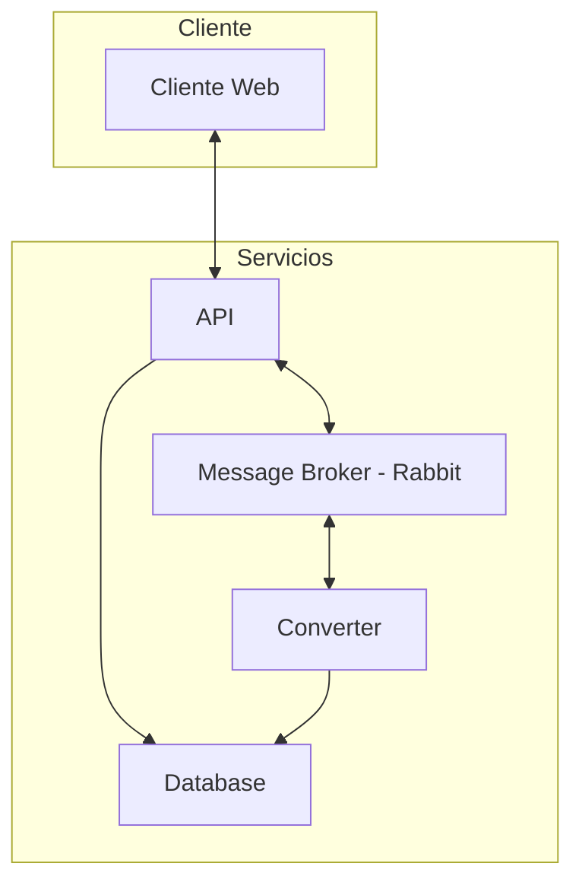
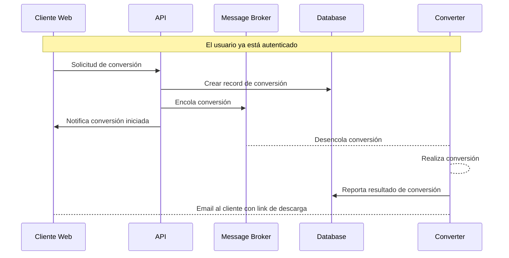

# Aplicación Cloud Convert

Aplicación que convierte archivos entre formatos de audio.

| Nombres   | Apellido   | Correo @uniandes               | Usuario de GitHub |
|-----------|------------|--------------------------------|-------------------|
| Ronald    | Lugo       | r.lugoq@uniandes.edu.co        | [@RonaldLugo]     |
| Alejandro | Santamaría | a.santamaria11@uniandes.edu.co | [@miso-alejosaur] |
| Hector    | Tenezaca   | h.tenezaca@uniandes.edu.co     | [@htenezaca]      |
| Javier    | López Grau | je.lopez816@uniandes.edu.co    | [@muniter]        |

## Objetivo

Validar la autenticación de la plataforma, garantiza la confidencialidad y evita la suplantación con medidas de doble factor.

## Arquitectura

La siguiente es la arquitectura de la aplicación



### Componentes

A nivel de infraestructura

| Componente     | Propósito                                                            |
|----------------|----------------------------------------------------------------------|
| Cliente        | Consume el servicio de conversión.                                   |
| API            | Autentica, y despacha los servicios.                                 |
| Converter      | Recibe solicitudes de conversión                                     |
| Message Broker | Cola de mensajería, por donde se despachan solicitudes de conversión |
| Database       | Persistencia de usuarios, tasks, metadata de conversiones            |


### Tecnológica

Se utiliza docker para orquestar el levantamiento de los cuatro componentes.

1. Postgres: motor de base de datos realcional.
2. Flask: web framework.
3. Rabbit MQ: cola de mensajería
3. Celery: framework que utiliza a Rabbit para implementar un job queue.
4. SqlAlchemy: ORM para la comunicación.
5. uvicorn: HTTP <-> ASGI bridge para la comunicación del Flask.
6. ffmpeg: convertidor de formatos de audio.


### Ejemplo de conversión



## Instrucciones

Requerimientos: docker

### Inicializar

Si corre en una máquina virtual primero debe descargar docker.

```bash
# Ubuntu
sudo apt install docker
```

1. En un terminal levantar la aplicación: `docker compose up --build`

### Destruir / Tear Down

Lo siguiente parará (si están corriendo) los contenedores, los elimina y también elimina los volúmenes. De tal forma que al levantar de nuevo el aplicativo empieza en blanco.

1. `docker compose down -v`

### Health Checks

Para confirmar el funcionamiento de las partes de la app:

```bash
# Cliente Web (En el response se verá el resultado)
curl localhost:8000/api-health
# Converter (Revisar los logs para ver el resultado)
curl localhost:8000/converter-health
# Ping, pong style (mirar los logs)
curl localhost:8000/ping
```

# Plan de pruebas

Para definir el plan necesitamos:

1. Establecer tiempo de una conversión cuando el sistema esta idle
2. Definir el tiempo de servicio aceptable para un archivo de peso de 1 mega.

## Escenarios

1. Máxima cantidad de request/minuto que soporta la aplicación con usuario concurrentes.

Limitantes:

- Archivo de tamaño mínimo de 5MB
- Tiempo de conversión (desde la solicitud hasta que el convertidor lo procesa) máximo de 10 minutos.

2. Máxima cantidad de archivos procesables por minuto.

Limitantes:

- Archivo de tamaño mínimo de 5MB
- Tiempo de respuesta máximo de 1.5 segundos
- Porcentaje de error máximo del 1%

# Análisis de Capacidad


### Limitaciones

TODO: 

<!-- links, leave at the end, this should be invisible -->
[@RonaldLugo]: https://github.com/RonaldLugo
[@miso-alejosaur]: https://github.com/miso-alejosaur
[@htenezaca]: https://github.com/htenezaca
[@muniter]: https://github.com/muniter
