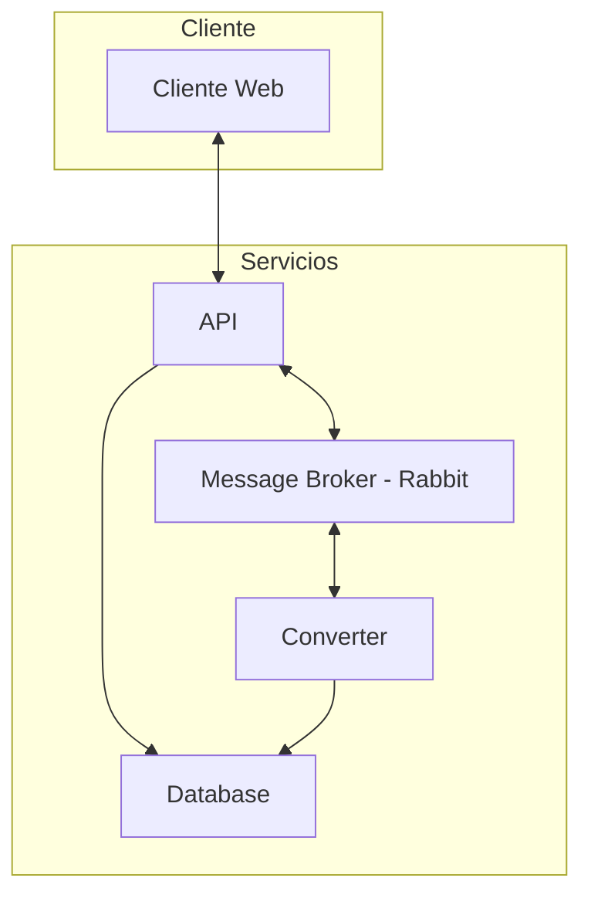
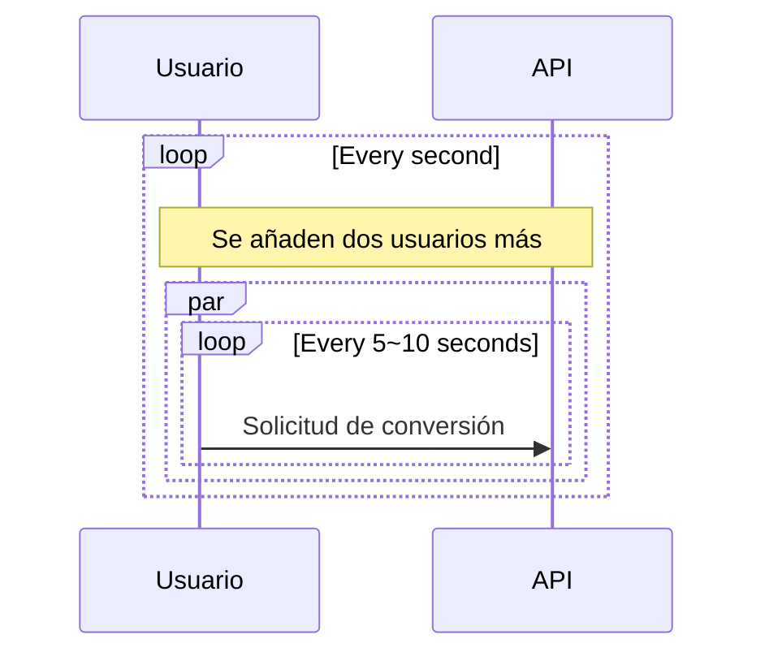

# Aplicación Cloud Convert

Aplicación que convierte archivos entre formatos de audio.

| Nombres   | Apellido   | Correo @uniandes               | Usuario de GitHub |
|-----------|------------|--------------------------------|-------------------|
| Ronald    | Lugo       | r.lugoq@uniandes.edu.co        | [@RonaldLugo]     |
| Alejandro | Santamaría | a.santamaria11@uniandes.edu.co | [@miso-alejosaur] |
| Hector    | Tenezaca   | h.tenezaca@uniandes.edu.co     | [@htenezaca]      |
| Javier    | López Grau | je.lopez816@uniandes.edu.co    | [@muniter]        |

## Objetivo

Validar la autenticación de la plataforma, garantiza la confidencialidad y evita la suplantación con medidas de doble factor.

## Arquitectura

La siguiente es la arquitectura de la aplicación



### Componentes

A nivel de infraestructura

| Componente     | Propósito                                                            |
|----------------|----------------------------------------------------------------------|
| Cliente        | Consume el servicio de conversión.                                   |
| API            | Autentica, y despacha los servicios.                                 |
| Converter      | Recibe solicitudes de conversión                                     |
| Message Broker | Cola de mensajería, por donde se despachan solicitudes de conversión |
| Database       | Persistencia de usuarios, tasks, metadata de conversiones            |


### Tecnológica

Se utiliza docker para orquestar el levantamiento de los cuatro componentes.

1. Postgres: motor de base de datos realcional.
2. Flask: web framework.
3. Rabbit MQ: cola de mensajería
3. Celery: framework que utiliza a Rabbit para implementar un job queue.
4. SqlAlchemy: ORM para la comunicación.
5. uvicorn: HTTP <-> ASGI bridge para la comunicación del Flask.
6. ffmpeg: convertidor de formatos de audio.


### Ejemplo de conversión


## Instrucciones Generales

### Inicializar

Requerimientos:
- Ubuntu server 20.04 o superior
- Git
- Docker

```bash
# 1. Clonar repositorio
git clone https://github.com/muniter/uni_cloud_convert.git
# 2. Entrar a carpeta
cd uni_cloud_convert
# 3. Levantar aplicación
docker compose up
```

Levantar todo en docker puede tomar unos minutos mientras se descargan las imágenes, será claro que ya está corriendo cuando se vean la cantidad de logs del sistema.


### Destruir / Tear Down

Lo siguiente parará (si están corriendo) los contenedores, los elimina y también elimina los volúmenes. De tal forma que al levantar de nuevo el aplicativo empieza en blanco.

```bash
# Se eliminan los volúmenes y también los archivos
# que se han recibido para conversión
docker compose down -v && sudo rm -rf ./assets/*
```

### Health Checks

Para confirmar el funcionamiento de las partes de la app:

```bash
# Cliente Web (En el response se verá el resultado)
curl localhost:8000/api-health
# Converter (Revisar los logs para ver el resultado)
curl localhost:8000/converter-health
# Ping, pong style (mirar los logs)
curl localhost:8000/ping
```

# Análisis de Capacidad

A continuación las pruebas realizadas, análisis de sus resultados y conclusiones sobre el rendimiento de la aplicación.

## Escenarios del Plan de pruebas

### 1. Capacidad de solicitudes

Máxima cantidad de request/minuto que soporta la aplicación con usuario concurrentes.

Este escenarios es de vital importancia para el aplicativo, nos permitirá conocer la cantidad de request que podremos en una ventana de tiempo manteniendo un nivel de servicio aceptable. En este caso consideramos que una media de 1.5 segundos y perdidas menores del 1% son acciones representativas en la operación.

Limitantes:

- Archivo de tamaño mínimo de 5MB
- Tiempo de respuesta aceptable de 1.5 segundos
- Porcentaje de error máximo del 1%
- Error de timeout si una respuesta demora más de 10 segundos

#### Detalle de operación

La prueba se realiza enviando requests concurrentes al endpoint de crear tareas, `/api/tasks` con un archivo de 5MB. Los request se presentan de la siguiente manera:

- El benchmark cuenta con usuarios
- Empieza con 2 usuarios
- Los usuarios envian un request entre 5 a 10 segundos de manera aleatoria.
- Cada segundo que pasa se añaden 2 nuevos usuarios.
- Usuarios máximos: 400

> Vista **simplificada del proceso**: aunque no estén dibujados en el diagrama todo está operando en conjunto, se encola, se guarda en db y el convertidor trabaja.



#### Instrucciones

Debe haber seguido antes las [Insrucciones Generales](#instrucciones-generales) para inicializar en al parte superior del documento.

1. Instalar locust:

```bash
pip install locust
```

2. Obtener **IP de la máquina virtual donde esta corriendo la aplicación.**

3. Iniciar locust.

```bash
# NOTA: reemplazar por la IP_DE_MAQUINA_VIRTUAL
locust --host=http://IP_DE_MAQUINA_VIRTUAL:8000 --users=400 --spawn-rate=2 --autostart
```

4. Navegar a `http://localhost:8089` para ver la interfaz de locust podrá ver tab de **estadisticas, gráficas e instrucciones**.

#### Resultados

El informe de resultados [se puede ver en su totalidad en la siguiente página][@res-scenario-1]

Estos son los puntos principales:
- El aplicativo es capaz de mantener un tiempo de respuesta menor a 1.5 segundos con 70 usuarios concurrentes, atendiendo a 7.4 request/segundo.
- El aplicativo es capaz de atender 440 request/minuto con archivos para conversión.
- El aplicativo se satura fuertemente a los 110 usuarios concurrentes con una respuesta media de 3.7 segundos.
- El aplicativo comienza a tener errores de timeout (request con más de 10 segundos de demora) con 170 usuarios concurrentes.

Durante la operación en punto crítico esta era la utilización de recursos:

> *obtenida con `docker stats`*

| CONTAINER ID | NAME      | CPU %   | MEM USAGE / LIMIT   | MEM %  | NET I/O         | BLOCK I/O       | PIDS |
|--------------|-----------|---------|---------------------|--------|-----------------|-----------------|------|
| 1e8053e774a9 | api       | 74.14%  | 147.7MiB / 1.929GiB | 7.48%  | 1.82GB / 3.39MB | 50.4MB / 4.29GB | 3    |
| e28e11546b38 | converter | 111.86% | 308.4MiB / 1.929GiB | 15.61% | 90.4kB / 59.9kB | 403MB / 746MB   | 21   |
| 75e643db542e | rabbit-mq | 0.77%   | 110.3MiB / 1.929GiB | 5.58%  | 329kB / 94.7kB  | 101MB / 2.4MB   | 26   |
| 802a21b1240c | database  | 1.72%   | 44.35MiB / 1.929GiB | 2.24%  | 774kB / 707kB   | 90.7MB / 117MB  | 13   |

A partir de esto:
- El aplicativo se encuentra principalmente restringido por la capacidad de procesamiento (CPU)
- El convertidor es el mayor consumidor de CPU
- El mayor consumidor de memoria es el convertidor
- Debido a la alta carga de request el API toma recursos que necesita el converter, haciendo lento su trabajo.
- Los componentes rabbit y database por estar escritos en lenguajes low level son mucho más eficiente en uso de recursos.

### 2. Capacidad de conversiones

Máxima cantidad de archivos procesables por minuto.

Este escenarios es de vital importancia para el aplicativo, nos permitirá conocer la cantidad de conversiones que podremos atender por parte de los usuarios, teniendo un tiempo de demoras aceptable de 10 minutos.

Limitantes:

- Archivo de tamaño mínimo de 5MB
- Tiempo de conversión (desde la solicitud hasta que el convertidor lo procesa) máximo de 10 minutos.

#### Detalle de operación

La prueba se realiza enviando un request a un endpoint especial `/benchmark/conversion/start` con un archivo de 5MB, el formato esperado y el número de tareas a ejecutar. El proceso funciona de la siguiente manera:

- El usuario benchmark (tú) hace el llamado a la api para iniciar el benchmark con un arhcivo (mp3 de 5MB), nuevo formato (wav) y número de tareas (400).
- El api genera los artefactos en base de datos y file system para las 400 tareas.
- El api encola las 400 tareas rápidamente
- El convertidor desencola y convierte

> Vista **simplificada del proceso**: aunque no estén dibujados en el diagrama todo está operando en conjunto, se encola, se guarda en db y el convertidor trabaja.


#### Resultados

Durante la prueba
TODO

| CONTAINER ID | NAME      | CPU %   | MEM USAGE / LIMIT   | MEM %  | NET I/O         | BLOCK I/O       | PIDS |
|--------------|-----------|---------|---------------------|--------|-----------------|-----------------|------|
| a9175656333b | converter | 195.87% | 552.5MiB / 1.929GiB | 27.96% | 275kB / 215kB   | 1.37GB / 6.05GB | 21   |
| f6a612bd4356 | api       | 0.01%   | 113.4MiB / 1.929GiB | 5.74%  | 6.73MB / 2.12MB | 6.62MB / 10.6GB | 3    |
| 035190f11926 | rabbit-mq | 0.15%   | 110.1MiB / 1.929GiB | 5.57%  | 958kB / 262kB   | 29.2MB / 25.2MB | 26   |
| 8568d6723a11 | database  | 0.01%   | 56.19MiB / 1.929GiB | 2.84%  | 1.43MB / 3.48MB | 52.4MB / 117MB  | 14   |

#### Instrucciones

Debe haber seguido antes las [Insrucciones Generales](#instrucciones-generales) para inicializar en al parte superior del documento.


1. Obtener **IP de la máquina virtual donde esta corriendo la aplicación.**

2. Enviar request para iniciar benchmark:

```bash
curl -F fileName=@sample.mp3 -F newFormat=wav -F taskNumber=400 http://IP_DE_MAQUINA_VIRTUAL:8000/benchmark/conversion/start
```

3. Esperar 10 minutos, para poder observar cuantas tareas se pudieron completar.

4. Obtener estadísticas de todos las tareas

```bash
curl http://IP_DE_MAQUINA_VIRTUAL:8000/benchmark/conversion/result
```

5. Generar reportes

### Limitaciones

- Python y su framework flask no son ideales para aplicaciones intensivas como la transferencia de grandes cantidades de datos (subir archivos)
- Python y sus utilidades de transformación nos son ideales para actividades que están fuertemente restringidas por el uso de recursos (conversión de archivos).


### Conclusiones

<!-- links, leave at the end, this should be invisible -->
[@RonaldLugo]: https://github.com/RonaldLugo
[@miso-alejosaur]: https://github.com/miso-alejosaur
[@htenezaca]: https://github.com/htenezaca
[@muniter]: https://github.com/muniter
[@res-scenario-1]: https://muniter.github.io/uni_cloud_convert/local_scenario_1
