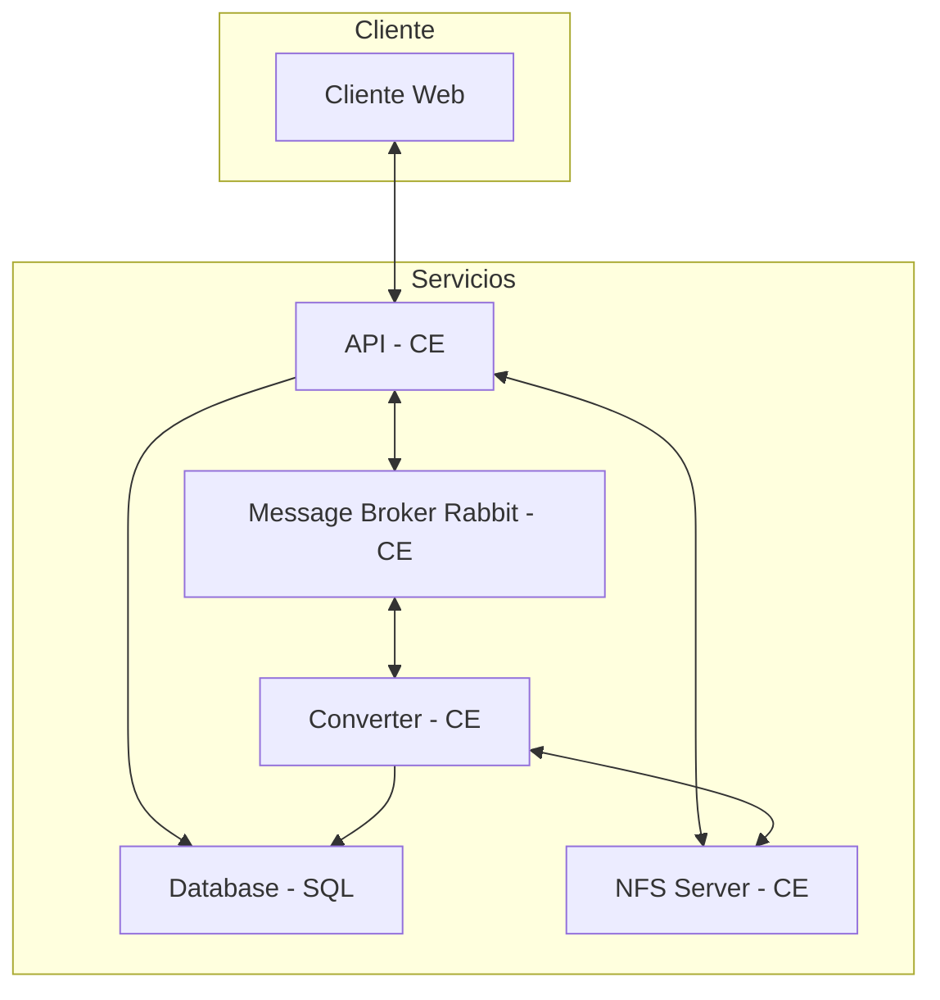
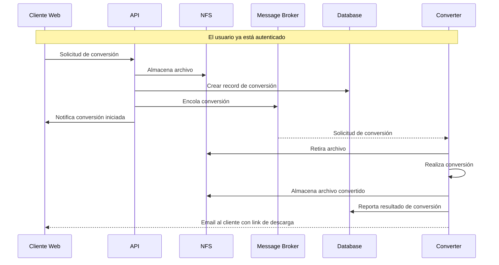
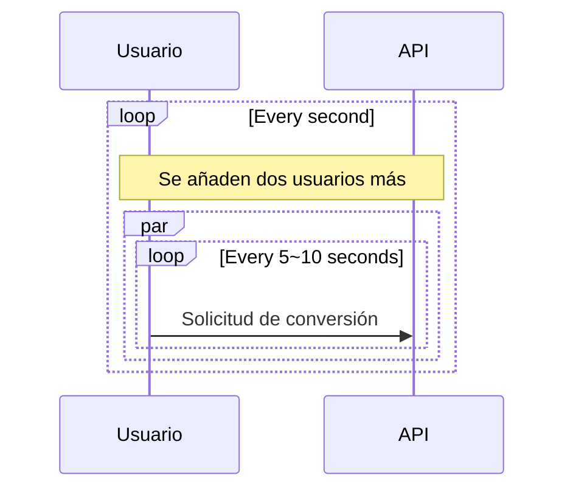
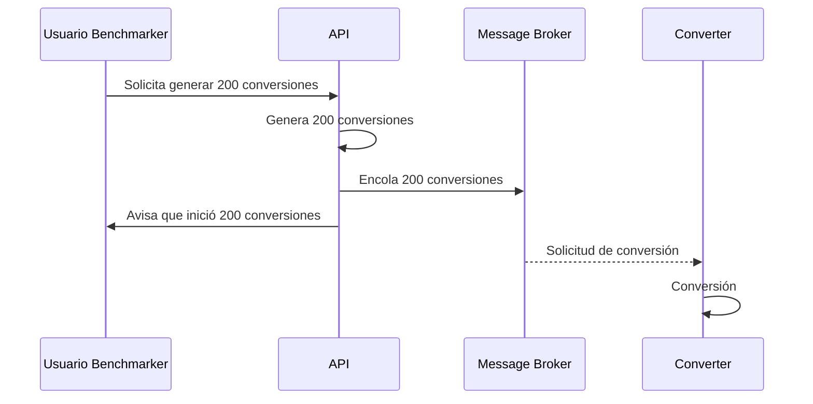

# Aplicación Cloud Convert

Aplicación que convierte archivos entre los siguientes formatos de audio: MP3, ACC, OGG, WAV, WMA

| Nombres   | Apellido   | Correo @uniandes               | Usuario de GitHub |
|-----------|------------|--------------------------------|-------------------|
| Ronald    | Lugo       | r.lugoq@uniandes.edu.co        | [@RonaldLugo]     |
| Alejandro | Santamaría | a.santamaria11@uniandes.edu.co | [@miso-alejosaur] |
| Hector    | Tenezaca   | h.tenezaca@uniandes.edu.co     | [@htenezaca]      |
| Javier    | López Grau | je.lopez816@uniandes.edu.co    | [@muniter]        |

## Objetivo

Desarrollar un servicio de conversión entre diferentes formatos de audio y poner a prueba su rendimiento y capacidad bajo unas características de infraestructura local definidas

## Arquitectura

Versión: **máquinas virtuales en GCP**

La siguiente es la arquitectura de la aplicación

Convención del diagrama:  
**CE**: Google Cloud Compute engine  
**SQL**: Google Cloud SQL  



### Componentes

A nivel de infraestructura

| Componente     | Propósito                                                            |
|----------------|----------------------------------------------------------------------|
| Cliente        | Consume el servicio de conversión.                                   |
| API            | Autentica, y despacha los servicios.                                 |
| Converter      | Recibe solicitudes de conversión                                     |
| NFS Server     | Provee carpeta común para transferir archivos entre converter y api  |
| Message Broker | Cola de mensajería, por donde se despachan solicitudes de conversión |
| Database       | Persistencia de usuarios, tasks, metadata de conversiones            |

Nota: el alcance actual no incluye el desarrollo del cliente web, por lo cual en este alcance se usa Postman para simular las peticiones que realizaría el cliente web

### Tecnológica

Se utiliza docker para orquestar el levantamiento de los cuatro componentes.

1. Postgres: motor de base de datos relacional.
2. Flask: web framework.
3. Rabbit MQ: cola de mensajería
3. Celery: framework que utiliza a Rabbit para implementar un job queue.
4. SqlAlchemy: ORM para la comunicación.
5. uvicorn: HTTP <-> ASGI bridge para la comunicación del Flask.
6. ffmpeg: convertidor de formatos de audio.
7. nfs: network file system, transfiere archivos en la red.

### Ejemplo de conversión

Este es el flujo normal que ocurre cuando un usuario crea una tarea de conversión.



### Endpoints implementados
| Endpoint                      | Método | Descipción                                     | Parámetros                                                                              | Consideraciones                                                                                                                                                                                                                               |
|-------------------------------|--------|------------------------------------------------|-----------------------------------------------------------------------------------------|-----------------------------------------------------------------------------------------------------------------------------------------------------------------------------------------------------------------------------------------------|
| `/api/auth/signup`            | POST   | Creación de cuenta de usuario                  | <ul><li>username</li><li>password1</li><li>password2</li><li>email</li></ul>            | <ul><li>Usuario y correo electrónico son únicos en el sistema</li><li>Password entre 5 a 20 caracteres, debe contener al menos una minúscula, una mayúscula, un número, un caracter especial [$#@], y no tener espacios/tabs/saltos</li></ul> |
| `/api/auth/login`             | POST   | Login que recupera token de autorización       | <ul><li>username</li><li>password</li></ul>                                             | <ul><li>El token retornado debe ser usado en funcionalidades que requieran autorización</li></ul>                                                                                                                                             |
| `/api/tasks`                  | GET    | Recupera todas las tareas de conversión        | <ul><li>Header Authorization: Bearer Token</li></ul>                                    |                                                                                                                                                                                                                                               |
| `/api/task`                   | POST   | Crea una nueva tarea de conversión de formatos | <ul><li>Header Authorization: Bearer Token</li><li>fileName</li><li>newFormat</li></ul> | <ul><li>Formatos permitidos: "mp3", "acc", "ogg", "wav", "wma"</li></ul>                                                                                                                                                                      |
| `/api/tasks/<int:id_task>`    | GET    | Recupera una tarea específica de conversión    | <ul><li>Header Authorization: Bearer Token</li></ul>                                    | <ul><li>id_task: id de tarea existente</li></ul>                                                                                                                                                                                              |
| `/api/tasks/<int:id_task>`    | PUT    | Actualiza una tarea de conversión existente    | <ul><li>Header Authorization: Bearer Token</li><li>newFormat</li></ul>                  | <ul><li>id_task: id de tarea existente</li><li>Formatos permitidos: "mp3", "acc", "ogg", "wav", "wma"</li></ul>                                                                                                                               |
| `/api/tasks/<int:task_id>`    | DELETE | Elimina una tarea de conversión existente      | <ul><li>Header Authorization: Bearer Token</li></ul>                                    | <ul><li>id_task: id de tarea existente</li></ul>                                                                                                                                                                                              |
| `/api/files/<string:file_id>` | GET    | Descarga de archivo                            | <ul><li>Header Authorization: Bearer Token</li></ul>                                    | <ul><li>id_task: id de tarea existente</li></ul>                                                                                                                                                                                              |
| `/benchmark/conversion/start` | POST   | Lanzamiento masivo concurrente de conversión   | <ul><li>fileName</li><li>newFormat</li><li>taskNumber</li></ul>  | <ul><li>Formatos permitidos: "mp3", "acc", "ogg", "wav", "wma"</li></ul>                                                                                                                                      |
| `/benchmark/conversion/result`| GET    | Obtiene las tareas con su estado |   |                                                                                                                                                                            |
| `/benchmark/conversion/data`  | GET    | Obtiene cantidad de tareas procesadas por minuto |   |                                                                                                                                                                            |

Información adicional en documentación del API en Postman en el siguiente link: [documentación API](https://documenter.getpostman.com/view/23989156/2s84LF4Gow), también puede usar [el archivo JSON que describe la API](./collections/Api.postman_collection.json)
- Configurar environment con las siguientes variables:
  - protocol: http
  - host: \<\<IP_DE_LA_API\>\>

## Instrucciones Generales de despliegue

Requerimientos:
  - Infraestructura:
    - 4 Máquinas virtuales tipo N1 f1-micro para los servicios
      - Debian 11 (bullseye)
    - 1 Instancia de cloud sql de desarrollo con Postgres 14
- Software a instalar
    - Git
    - Docker
    - nfs-commons: utilidades nfs

### Instrucciones comunes

Los siguientes pasos son iguales para todas las máquinas a instalar, **se suponen lo siguiente**:

- Se escogió el tipo correcto de instancia
- **Las instancias comparten la misma red privada**
- **Las instancias deben llamarse**: api, rabbitmq, converter, nfs
- Las instancias tienen habilitado tráfico http (configuración al crearlas)
- Su usuario es `maestria`, y su home directory es `/home/maestria`
- Tiene acceso a root

1. Instalar dependencias:

```bash
sudo apt update && sudo apt install git docker docker-compose nfs-common
```

2. Clonar el repositorio

```bash
git clone https://github.com/muniter/uni_cloud_convert.git
```

3. Entrar a la carpeta

```bash
cd uni_cloud_convert
```

#### NFS

**El NFS debe ser el primer componente en ser desplegado, para que el API y converter puedan montar el share**.

1. Estando en la base del repositorio moverse a la carpeta [nfs](./nfs) y correr el script de startup.

```bash
cd uni_cloud_convert/nfs
sudo ./startup.py
```

#### Rabbit

1. Estando en la base del repositorio moverse a la carpeta [rabbit-mq](./rabbit-mq) y correr el script de startup.

```bash
cd uni_cloud_convert/rabbit-mq
sudo ./startup.py
```

#### Database

Crear la instancia en Cloud-SQL de Postgres.

Puede seguir las [siguientes instrucciones](https://cloud.google.com/sql/docs/postgres/create-instance) para la creación.

**Nota: es muy importante que seleccione que la instancia tenga Private IP y comparta la misma red que los compute engine.** Para que se puedan comunicar.

Si tiene algún problema en la configuración de Private IP pude seguir el [siguiente instructivo](https://cloud.google.com/sql/docs/postgres/configure-private-ip)

#### API

1. Ya teniendo configurada la base de datos, tomar nota de la IP Privada de esta y las credenciales que utilizó y colocarlas en las variables de entorno del [.env](./.env) `POSTGRES_HOST, POSTGRES_USER, POSTGRES_DB, POSTGRES_PASSWORD`
1. Estando en la base del repositorio moverse a la carpeta [services/api](./services/api) y correr el script de startup.

```bash
cd uni_cloud_convert/services/api
sudo ./startup.py
```

#### Converter

1. Ya teniendo configurada la base de datos, tomar nota de la IP Privada de esta y las credenciales que utilizó y colocarlas en las variables de entorno del [.env](./.env) `POSTGRES_HOST, POSTGRES_USER, POSTGRES_DB, POSTGRES_PASSWORD`
1. Estando en la base del repositorio moverse a la carpeta [services/converter](./services/converter) y correr el script de startup.

```bash
cd uni_cloud_convert/services/converter
sudo ./startup.py
```

### Health Checks

Con estas instrucciones están listo el despliegue, se puede continuar haciendo health checks.

Para confirmar el funcionamiento de las partes de la app:

```bash
# Cliente Web (En el response se verá el resultado)
curl $API_PUBLIC_IP/api-health
# Converter (Revisar los logs para ver el resultado)
curl $API_PUBLIC_IP/converter-health
# Ping, pong style (mirar los logs)
curl $API_PUBLIC_IP/ping
```

### Comandos frecuentes
```bash
# Rendimiento de la máquina virtual
top
# Rendimiento de containers
sudo docker stats
# Containers en ejecución
sudo docker container ls
# conectarse a un container en particular con bash 
sudo docker exec -it <<container_name>> bash
```

<div style="page-break-after: always; visibility: hidden"> 
</div>

# Análisis de Capacidad


Nota: **Se hace comparativo en cada punto con [la entrega de la primera semana](https://github.com/muniter/uni_cloud_convert/tree/release-1).**

Se realizan pruebas de carga y estrés a la aplicación para lograr dimensionar la capacidad de la misma en un entorno de infraestructura definido. A continuación se describen las pruebas realizadas, los análisis de los resultados y las conclusiones sobre el rendimiento de la aplicación

## Inicializar máquina virtual de prueba

Requerimientos:
- 1 Máquina virtual tipo E2 e2-small para las pruebas
  - Debian 11 (bullseye)
- Software a instalar
    - Git
    - Python3
    - pip: Python package manager
    - locust

### Instrucciones

1. Clonar el repositorio

```bash
git clone https://github.com/muniter/uni_cloud_convert.git
```

2. Instalar dependencias

```bash
sudo apt install python3 python3-pip
```

3. Cambiar de usuario a root:

```bash
sudo su
```

4. Instalar locust

```bash
pip install locust==2.12.2
```

5. Cerrar sesión: necesario para que posteriormente aparezca el comando `locust` en `$PATH`

```bash
exit
```

6. Iniciar sesión y colocarse como usuario root

```bash
sudo su
```

7. Habilitar variable de entorno `STRESS_TEST` en la máquina converter.

**NOTA: Antes de correr cualquier prueba no olvide deshabilitar el envío de correos, editando en el archivo [.env](./.env):**

```bash
STRESS_TEST=1
```

## Preámbulo

### Hallazgos en ejecución en máquinas virtuales

Nota: **Se hace comparativo en cada punto con [la entrega de la primera semana](https://github.com/muniter/uni_cloud_convert/tree/release-1).**

- Incremento en nivel de complejidad: En el entorno de una sola máquina era solo usar un comando para levantar todo, ahora es necesario orquestar múltiples cosas.
- La aplicación opera de forma satisfactoria con los diferentes servicios corriendo en su propia máquina.

#### Procesamiento CPU

- Pasamos de 2vCPU a 4 máquinas con 1vCPU c/u y se removió un servicio a PaaS (SQL).
  - Sin embargo se redujo la capacidad de procesamiento tanto en el API como el converter que son los que más demandaban la CPU.
  - Los componentes NFS, Database, y Rabbit no fueron afectados, debido a la baja demanda que hacemos a estos.
  - Debido a que el convertidor pasó a solo tener 1vCPU hubo la necesidad de reducir el número de workers que celery invocaba de 5 a 1. La vCPU del sistema se bloqueaba completamente con la configuración anterior.
- En general este sistema es principalmente bottlenecked por los recursos de CPU.
- La introducción del sistema NFS afecta el aprovechamiento de recursos de CPU pues al python trabajar single threaded y blocking, se introducen considerables demoras al escribir un archivo a disco.

#### Memoria

- Pasamos de 2Gb a 2.4Gb de memoria distribuido.
  - Esta cantidad de memoria es suficiente para el uso de la aplicación, no presentó problemas.
  - Debido a que el converter está invocando un programa escrito eficiente `ffmpeg` escrito en C, la capacidad de memoria es suficiente.

#### Almacenamiento

- Pasamos de tener 30Gb de almacenamiento a 40Gb
- La imagen de Debian instalada en las máquinas estaba muy optimizada a ocupar poco espacio menos de 2Gb
  - Por lo cual los 8Gb de espacio restante por máquina fueron suficientes.
- La introducción de NFS **introdujo inmensas latencias en la escritura a disco**.

## Escenarios del Plan de pruebas

### 1. Capacidad de solicitudes

Máxima cantidad de request/minuto que soporta la aplicación con usuario concurrentes.

Este escenarios es de vital importancia para el aplicativo, nos permitirá conocer la cantidad de request que podremos atender en una ventana de tiempo manteniendo un nivel de servicio aceptable. En este caso consideramos que una media de 1.5 segundos y perdidas menores del 1% son acciones representativas en la operación.

Limitantes:

- Archivo de tamaño mínimo de 5MB
- Tiempo de respuesta aceptable de 1.5 segundos
- Porcentaje de error máximo del 1%
- Error de timeout si una respuesta demora más de 10 segundos

#### Detalle de operación

La prueba se realiza enviando requests concurrentes al endpoint de crear tareas, `/api/tasks` con un archivo de 5MB. Los request se presentan de la siguiente manera:

- El benchmark cuenta con usuarios
- Empieza con 2 usuarios
- Los usuarios envian un request entre 5 a 10 segundos de manera aleatoria.
- Cada segundo que pasa se añaden 2 nuevos usuarios.
- Usuarios máximos: 400

> Vista **simplificada del proceso**: aunque no estén dibujados en el diagrama todo está operando en conjunto, se encola, se guarda en db y el convertidor trabaja.



#### Instrucciones

Debe haber seguido antes todas las [instrucciones de despliegue](#instrucciones-generales-de-despliegue), tener la aplicación funcionando ([probar con health checks](#health-checks)) y haber seguido las instrucciones para [inicializar la máquina de pruebas](#inicializar-máquina-virtual-de-prueba).

1. Hacer login a la máquina de pruebas, y ser el usuario root:

```bash
# Ser usuario root
sudo su
```

2. Iniciar locust

```bash
# NOTA: reemplazar por la IP_DE_MAQUINA_VIRTUAL_APP
locust --host=http://api --users=400 --spawn-rate=2 --web-port --autostart
```

3. Navegar a `http://IP_DE_MAQUINA_VIRTUAL_TEST` para ver la interfaz de locust podrá ver tab de **estadísticas, gráficas e instrucciones**.

#### Resultados

El informe de resultados [se puede ver en su totalidad en la siguiente página][@res-scenario-1-2]

Nota: El informe de el ***despliegue local*** [se puede consultar aquí para comparación][@res-scenario-1-1]

Estos son los puntos principales:
- El aplicativo es capaz de mantener un tiempo de respuesta menor a 1.5 segundos con 66 usuarios concurrentes, atendiendo a 6 request/segundo, esto es una disminución comparado al despliegue local que fueron 70 usuarios y 7.4 request/segundo.
- El aplicativo es capaz de atender 360 request/minuto con archivos para conversión.
- La curva de tiempo de respuesta es mucho más suavizada que el despliegue local, es más predecible. Esto lo atribuimos al hecho de que el convertidor no está compartiendo CPU con el API.
- El aplicativo se satura fuertemente a los 86 usuarios concurrentes con una respuesta media de 4.1 segundos.
- El aplicativo comienza a tener errores de timeout (request con más de 10 segundos de demora) con 146 usuarios concurrentes, a diferencia de local con 170 usuario.

Cuadro comparativo:

| Datos \ Ambiente                                         | Local         | GCP         |
|----------------------------------------------------------|---------------|-------------|
| RPS (<1500ms)                                            | 7.4s, 440/min | 6s, 360/min |
| Usuarios (<1500ms)                                       | 70            | 56          |
| Peticiones concurrentes que generan Timeouts (> 10 segs) | 170           | 146         |

Durante la operación en punto crítico esta era la utilización de recursos del API:

> *obtenida con con el dashboard de GCP


A partir de esto:
- El API se encuentra principalmente restringido por la capacidad de procesamiento (CPU)
- Durante un periodo de tiempo está usando más CPU de la que es asignada (esta es una propiedad de la máquina F1 asignada), el incremento y posterior estabilización de cantidad de CPU disponible lo vemos marcadamente con los incrementos en tiempo de respuesta.
- El **API** esta **restringida** por recursos CPU.

### 2. Capacidad de conversiones

Máxima cantidad de archivos procesables por minuto.

Este escenarios es de vital importancia para el aplicativo, nos permitirá conocer la cantidad de conversiones que podremos atender por parte de los usuarios, teniendo un tiempo de demoras aceptable de 10 minutos.

Limitantes:

- Archivo de tamaño mínimo de 5MB
- Tiempo de conversión (desde la solicitud hasta que el convertidor lo procesa) máximo de 10 minutos.

#### Detalle de operación

La prueba se realiza enviando un request a un endpoint especial `/benchmark/conversion/start` con un archivo de 5MB, el formato esperado y el número de tareas a ejecutar. El proceso funciona de la siguiente manera:

- El usuario benchmark (tú) hace el llamado a la api para iniciar el benchmark con un archivo (mp3 de 5MB), nuevo formato (wav) y número de tareas (200).
- El api genera los artefactos en base de datos y file system para las 200 tareas.
- El api encola las 200 tareas rápidamente
- El convertidor desencola y convierte

> Vista **simplificada del proceso**: aunque no estén dibujados en el diagrama todo está operando en conjunto, se encola, se guarda en db y el convertidor trabaja.



**Nota**: en este escenario fue necesario cambiar de 400 conversiones en la versión local, a 200 conversiones. Debido a que el tiempo que le tomaba al API copiar 400 archivos excedía el timeout de Flask ('[CRITICAL] WORKER TIMEOUT', alcanzaba a 246), debido a la latencia inducida por el nfs (synchronous file writing)

#### Resultados

El informe de resultados [se puede ver en su totalidad en la siguiente página][@res-scenario-2-2]

Nota: El informe de el ***despliegue local*** [se puede consultar aquí para comparación][@res-scenario-2-1]

En esta prueba vimos un decremento del 75% de rendimiento  en comparación a las pruebas locales, comparando métricas:

| Datos \ Ambiente                                           | Local                | GCP              | 
|------------------------------------------------------------|----------------------|------------------|
| Promedio de archivos procesados por minuto                 | 18                   | 3                |
| Máximo de archivos procesados por minuto                   | 20                   | 7                |
| Valor más frecuente de archivos procesados por minuto      | 20                   | 2-3              |
| Concurrencia soportada (peticiones simultáneas)            | 400                  | 200              |
| Peticiones atendidas en menos de 10 minutos                | 193                  | 28               |
| Tiempo de conversión para la concurrencia enviada          | 400 en 20 minutos    | 82 en 33 minutos |

Esto lo atribuimos a:
- Al ser una tarea CPU bound, la disminución de cores en número y capacidad hizo un gran impacto. Si hacemos una comparación inocente 1vCPU core de GCP equivale a 0.5 CPU core de la máquina virtual que probamos, por tanto el 25% de rendimiento.
- El punto anterior se compenetra con la necesidad de cambiar la configuración de workers corriendo en el convertidor de 5 a 1, pues la máquina se bloqueaba completamente.

Ahora miremos el consumo de recursos converter:

> *obtenida con con el dashboard de GCP


- Vemos primeramente el gran boost que tenemos al principio, por la característica de máquina, y vemos como esto se presenta en la gráfica de resultados al ser el aplicativo capaz de convertir 7 archivos en el primer minuto, un poco más del doble del promedio.
- Esta es una actividad completamente bottlenecked por la CPU por lo cual vemoz que no la deja descanasr en ningún momento.
- El hecho de que siempre está saturada la CPU confirma que el solo utilizar 1 worker es la decisión correcta, al ser también un proceso 100% síncrono.


#### Instrucciones

Debe haber seguido antes todas las [instrucciones de despliegue](#instrucciones-generales-de-despliegue), tener la aplicación funcionando ([probar con health checks](#health-checks)) y haber seguido las instrucciones para [inicializar la máquina de pruebas](#inicializar-máquina-virtual-de-prueba).

1. Hacer login a la máquina de pruebas
2. Enviar el request para iniciar el benchmark

```bash
curl -F fileName=@sample.mp3 -F newFormat=wav -F taskNumber=200 http://api/benchmark/conversion/start
```

---
**Ahora desde su máquina local:**

3. Copiar localmente la carpeta **reporte** del repositorio, modificar la primera línea del archivo **report.js**

```bash
http://$IP_DE_LA_API/benchmark/conversion/data
```

4. Ejecutar index.html y monitorear durante 10 minutos para poder observar cuantas tareas se pudieron completar, y posteriormente para identificar cuando se completen las 400 peticiones

Un ejemplo del reporte es el siguiente: [reporte][@res-scenario-2-1]


### Conclusiones y Limitaciones

**Revisar análisis de resultados de cada escenario**:

- Python y sus utilidades de transformación nos son ideales para actividades que están fuertemente restringidas por el uso de recursos (conversión de archivos).
- La aplicación tiene como principal bottleneck la CPU para el converter y la api.
- La introducción de NFS produce gran latencia para escribir el archivo por parte del api, y luego obtenerlo del lado del convertidor.
- El uso de git y docker optimiza el proceso de desarrollo colaborativo, simplifica el proceso de despliegue en la máquina virtual y estandariza el despliegue en pro de un comportamiento similar en diferentes máquinas virtuales 
- Definir tamaños máximos de archivos y estimar la capacidad máxima esperada de peticiones de carga, de tal manera que se pueda estimar cual es la capacidad de almacenamiento límite a la que podría llegar el sistema
- El uso de colas de mensajería permite desacoplar las dependencias de la respuesta del api frente al procesamiento de archivos, favoreciendo una mejor gestión y respuesta al usuario
- Las limitaciones en la infraestructura donde opera el sistema, afecta directamente los tiempos de respuesta, la cantidad de transacciones concurrentes y la velocidad en que se completa un proceso de conversión


<!-- links, leave at the end, this should be invisible -->
[@RonaldLugo]: https://github.com/RonaldLugo
[@miso-alejosaur]: https://github.com/miso-alejosaur
[@htenezaca]: https://github.com/htenezaca
[@muniter]: https://github.com/muniter
[@res-scenario-1-1]: https://muniter.github.io/uni_cloud_convert/local_scenario_1
[@res-scenario-1-2]: https://muniter.github.io/uni_cloud_convert/gcp_local_escenario_1
[@res-scenario-2-1]: https://raw.githubusercontent.com/muniter/uni_cloud_convert/gh-pages/local_scenario_2.pdf
[@res-scenario-2-2]: https://raw.githubusercontent.com/muniter/uni_cloud_convert/gh-pages/gcp_local_escenario_2.pdf
