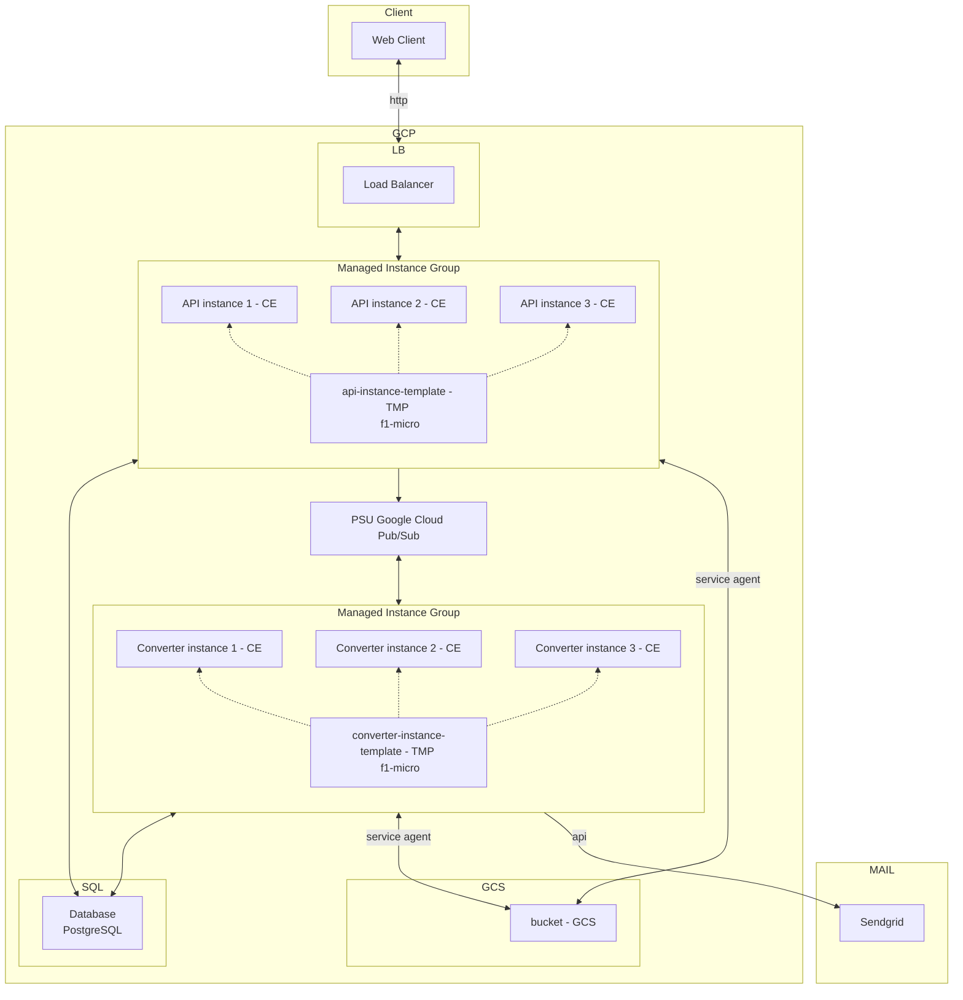
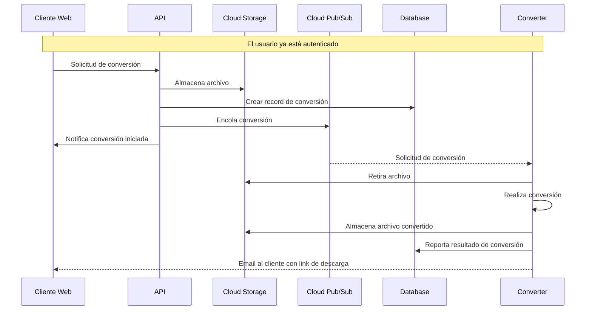
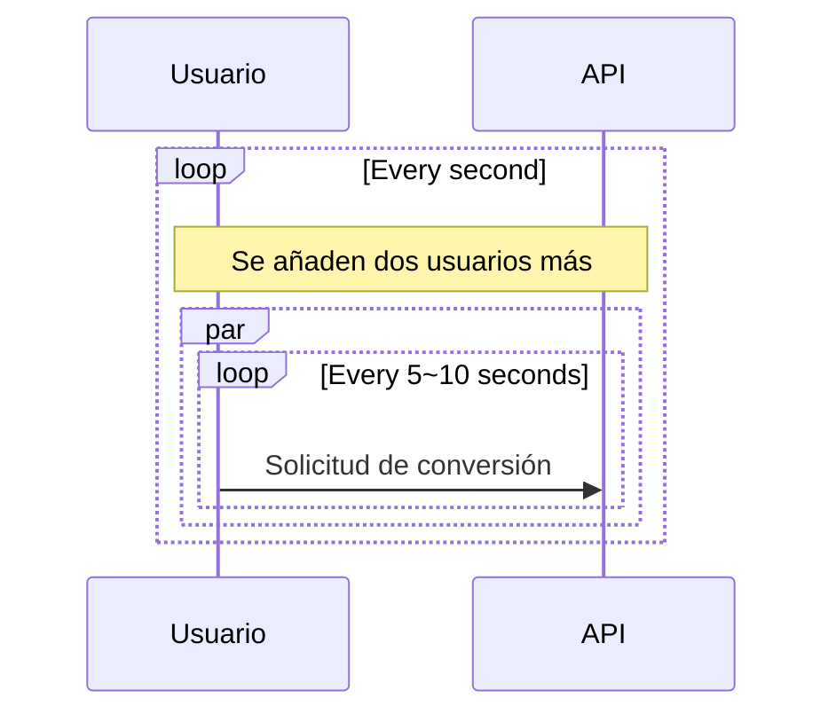
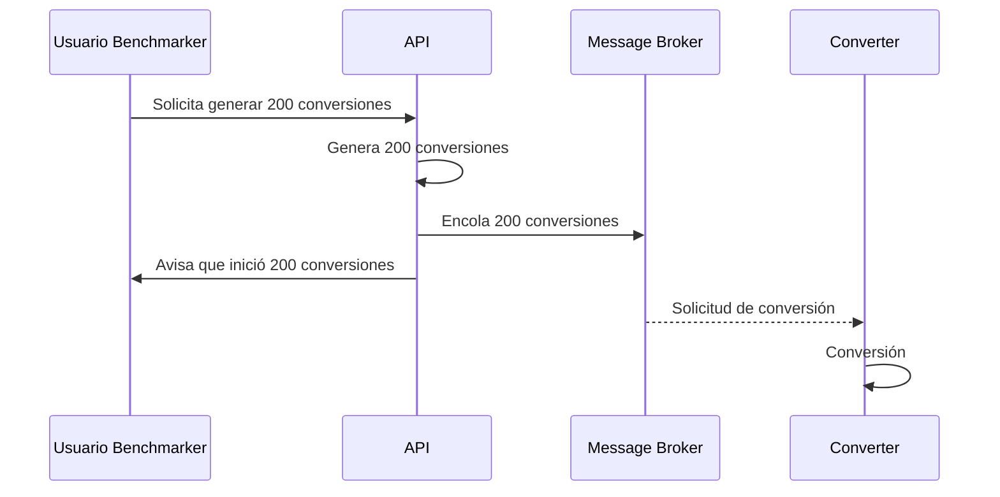

# Aplicación Cloud Convert

Aplicación que convierte archivos entre los siguientes formatos de audio: MP3, ACC, OGG, WAV, WMA

| Nombres   | Apellido   | Correo @uniandes               | Usuario de GitHub |
|-----------|------------|--------------------------------|-------------------|
| Ronald    | Lugo       | r.lugoq@uniandes.edu.co        | [@RonaldLugo]     |
| Alejandro | Santamaría | a.santamaria11@uniandes.edu.co | [@miso-alejosaur] |
| Hector    | Tenezaca   | h.tenezaca@uniandes.edu.co     | [@htenezaca]      |
| Javier    | López Grau | je.lopez816@uniandes.edu.co    | [@muniter]        |

## Objetivo

Desarrollar un servicio de conversión entre diferentes formatos de audio y poner a prueba su rendimiento y capacidad bajo unas características de infraestructura local definidas

* alcance semana 3: escalabilidad en la capa web

## Arquitectura

Versión: **máquinas virtuales en GCP + escalabilidad en capa web**

La siguiente es la arquitectura de la aplicación

Convención del diagrama:  
**GCP**: Google Cloud Platform  
**CE**: Google Cloud Compute engine  
**SQL**: Google Cloud SQL  
**LB**: Load Balancer  
**MIG**: Managed Instance Group  
**TMP**: Instance Template  
**PSU**: Google Cloud Pub/Sub  
**GCS**: Google Cloud Storage  



### Componentes

A nivel de infraestructura

| Componente        | Propósito                                                                 |
|-------------------|---------------------------------------------------------------------------|
| Client            | Consume el servicio de conversión.                                        |
| Load Balancer     | A través de una sola dirección ip, distribuye las peticiones hacia el API |
| Manage Instance Group    | Gestiona las instancias de tanto de la API y del converter                     |
| Instance Template | Plantilla de instancias de APIs                                           |
| API               | Autentica, y despacha los servicios.                                      |
| Cloud Pub/Sub     | Servició de mensajería, por donde se despachan solicitudes de conversión  |
| Converter         | Recibe solicitudes de conversión                                          |
| Bucket            | Almacenamiento común de transferencia de archivos para converter y api    |
| Database          | Persistencia de usuarios, tasks, metadata de conversiones                 |
| Mail              | Servicio para el envío de email de notificación de conversión finalizada  |

*Nota: el alcance actual no incluye el desarrollo del cliente web, por lo cual en este alcance se usa Postman para simular las peticiones que realizaría el cliente web*

### Tecnológica

Se utiliza docker para orquestar el levantamiento de los componentes API y Converter

#### Tecnologías

1. Postgres: motor de base de datos relacional.
2. Flask: web framework.
3. Cloud Pub/Sub: sistema de mensajería asíncrona.
4. SqlAlchemy: ORM para la comunicación.
5. uvicorn: HTTP <-> ASGI bridge para la comunicación del Flask.
6. ffmpeg: convertidor de formatos de audio.
7. Google Cloud storage: Almaacenamiento de archivos.
8. Load Balancer: balanceador de carga de peticiones HTTP.
9. Managed Instance Group: orquestador de instancias de computo.
10. Instance Template: plantilla de instancias de computo.

#### Servicios de Google Cloud Platform utilizados

1. Load Balancer
2. Managed Instance Group
3. Compute Engine
4. SQL
5. Cloud Storage
6. Monitoring
7. Pub/Sub

### Ejemplo de conversión

Este es el flujo normal que ocurre cuando un usuario crea una tarea de conversión.



### Endpoints implementados

| Endpoint                      | Método | Descipción                                     | Parámetros                                                                              | Consideraciones                                                                                                                                                                                                                               |
|-------------------------------|--------|------------------------------------------------|-----------------------------------------------------------------------------------------|-----------------------------------------------------------------------------------------------------------------------------------------------------------------------------------------------------------------------------------------------|
| `/api/auth/signup`            | POST   | Creación de cuenta de usuario                  | <ul><li>username</li><li>password1</li><li>password2</li><li>email</li></ul>            | <ul><li>Usuario y correo electrónico son únicos en el sistema</li><li>Password entre 5 a 20 caracteres, debe contener al menos una minúscula, una mayúscula, un número, un caracter especial [$#@], y no tener espacios/tabs/saltos</li></ul> |
| `/api/auth/login`             | POST   | Login que recupera token de autorización       | <ul><li>username</li><li>password</li></ul>                                             | <ul><li>El token retornado debe ser usado en funcionalidades que requieran autorización</li></ul>                                                                                                                                             |
| `/api/tasks`                  | GET    | Recupera todas las tareas de conversión        | <ul><li>Header Authorization: Bearer Token</li></ul>                                    |                                                                                                                                                                                                                                               |
| `/api/task`                   | POST   | Crea una nueva tarea de conversión de formatos | <ul><li>Header Authorization: Bearer Token</li><li>fileName</li><li>newFormat</li></ul> | <ul><li>Formatos permitidos: "mp3", "acc", "ogg", "wav", "wma"</li></ul>                                                                                                                                                                      |
| `/api/tasks/<int:id_task>`    | GET    | Recupera una tarea específica de conversión    | <ul><li>Header Authorization: Bearer Token</li></ul>                                    | <ul><li>id_task: id de tarea existente</li></ul>                                                                                                                                                                                              |
| `/api/tasks/<int:id_task>`    | PUT    | Actualiza una tarea de conversión existente    | <ul><li>Header Authorization: Bearer Token</li><li>newFormat</li></ul>                  | <ul><li>id_task: id de tarea existente</li><li>Formatos permitidos: "mp3", "acc", "ogg", "wav", "wma"</li></ul>                                                                                                                               |
| `/api/tasks/<int:task_id>`    | DELETE | Elimina una tarea de conversión existente      | <ul><li>Header Authorization: Bearer Token</li></ul>                                    | <ul><li>id_task: id de tarea existente</li></ul>                                                                                                                                                                                              |
| `/api/files/<string:file_id>` | GET    | Descarga de archivo                            | <ul><li>Header Authorization: Bearer Token</li></ul>                                    | <ul><li>id_task: id de tarea existente</li></ul>                                                                                                                                                                                              |
| `/benchmark/conversion/start` | POST   | Lanzamiento masivo concurrente de conversión   | <ul><li>fileName</li><li>newFormat</li><li>taskNumber</li></ul>  | <ul><li>Formatos permitidos: "mp3", "acc", "ogg", "wav", "wma"</li></ul>                                                                                                                                      |
| `/benchmark/conversion/result`| GET    | Obtiene las tareas con su estado |   |                                                                                                                                                                            |
| `/benchmark/conversion/data`  | GET    | Obtiene cantidad de tareas procesadas por minuto |   |                                                                                                                                                                            |

Información adicional en documentación del API en Postman en el siguiente link: [documentación API](https://documenter.getpostman.com/view/23989156/2s84LF4Gow), también puede usar [el archivo JSON que describe la API](./collections/Api.postman_collection.json)

## Instrucciones Generales de despliegue

Requerimientos:
  - Infraestructura:
    - 1 balanceador de carga con protocolo http habilitado y funcionando en dos availability zone
    - 1 imagen de disco pre-configurado con base a api
    - 1 plantilla de instancia configurada con la imagen de disco api
    - 1 grupo de instancias administradas con base a la plantilla de instancia de api
    - 1 imagen de disco pre-configurado con base a converter
    - 1 plantilla de instancia configurada con la imagen de disco converter
    - 1 grupo de instancias administradas con base a la plantilla de instancia de converter
    - 1 Instancia de cloud sql de desarrollo con Postgres 14
    - 1 topic de pub/sub
    - 1 subscription de pub/sub
    - 1 bucket de cloud storage
- Software a instalar
    - Git
    - Docker
    - Python

### Instrucciones comunes

Los siguientes pasos son iguales para todas las máquinas a instalar, **se suponen lo siguiente**:

- Se escogió el tipo correcto de instancia
- **Las instancias comparten la misma red privada**
- El grupo de instancias api administrado debe llamarse: api-group
- Las instancias tienen habilitado tráfico http (configuración al crearlas)
- El grupo de instancias converter administrado debe llamarse: converter-group
- Su usuario es `maestria`, y su home directory es `/home/maestria`
- Tiene acceso a root

1. Instalar dependencias:

```bash
sudo apt update && sudo apt install git docker docker-compose
```

2. Clonar el repositorio

```bash
git clone https://github.com/muniter/uni_cloud_convert.git
```

3. Entrar a la carpeta

```bash
cd uni_cloud_convert
```

#### Bucket en Cloud Storage

1. Configurar permisos de Service Agent y descargar archivo **service-account.json**

El servicio se encargará de crear el bucket si no existe a partir del nombre configurado en el archivo [.env](./.env)

Puede seguir las [siguientes instrucciones](https://cloud.google.com/storage/docs/creating-buckets) para la creación

#### Cloud Pub/Sub

1. Habilitar el servicio de Cloud Pub/Sub

El API hará el bootstrap de la creación de los recursos necesarios para el funcionamiento de la aplicación, por lo que no es necesario crearlos manualmente.

Tomar en cuenta que para este proyecto por la lógica de negocio se debe activar la siguiente configuración en la _Subscripción_:

- **Acknowledge deadline**: 1 min
- **Exactly once delivery**: Enabled

#### Database

Crear la instancia en Cloud-SQL de Postgres.

Puede seguir las [siguientes instrucciones](https://cloud.google.com/sql/docs/postgres/create-instance) para la creación.

**Nota: es muy importante que seleccione que la instancia tenga Private IP y comparta la misma red que los compute engine.** Para que se puedan comunicar.

Si tiene algún problema en la configuración de Private IP pude seguir el [siguiente instructivo](https://cloud.google.com/sql/docs/postgres/configure-private-ip)

#### Instancias API dentro de un Managed Instance Group

Crear una instancia de Compute Engine N1 f1-micro para configurar el API, luego se puede desactivar/eliminar

1. Ya teniendo configurada la base de datos, tomar nota de la IP Privada de esta y las credenciales que utilizó y colocarlas en las variables de entorno del [.env](./.env) `POSTGRES_HOST, POSTGRES_USER, POSTGRES_DB, POSTGRES_PASSWORD`

2. Copiar localmente el archivo **service-account.json** generado en la configuración del bucket en Cloud Storage, el cual ya se encuentra configurado en las variables de entorno [.env](./.env)
```bash
GOOGLE_APPLICATION_CREDENTIALS=./service-account.json
```

3. Estando en la base del repositorio moverse a la carpeta [services/api](./services/api) y correr el script de startup.
```bash
cd /home/maestria/uni_cloud_convert/services/api
sudo ./startup.py
```
4. A partir de la máquina de API preparada, generar una imagen de disco llamada **api-disk-image**

5. Crear una plantilla de instancias llamada **api-instance-template-storage** seleccionando la imagen de disco creada en el paso anterior [ver paso a paso](https://cloud.google.com/compute/docs/instance-templates/create-instance-templates#gcloud_1)

6. Configurar startup-script

```bash
cd /home/maestria/uni_cloud_convert/services/converter
sudo git pull
sudo docker compose up -d
```

7. Crear un grupo de instancias administradas con nombre **api-group** seleccionando la plantilla de instancias creada en el paso anterior [ver paso a paso](https://cloud.google.com/compute/docs/instance-groups/create-mig-with-basic-autoscaling), con las siguientes configuraciones: 
  
  * Ubicación: Varias zonas (Elegir dos zonas dentro de la misma región)
  * Autoscaling: on
  * Mínimo: 1 instancia
  * Máximo: 3 instancias
  * Métrica de autoscaling: CPU > 60%

#### Load Balancer

1. Configurar balanceador de carga con nombre **web-map-http** direccionado el servicio de backend al grupo de instancias administradas **api-group** [ver paso a paso](https://cloud.google.com/iap/docs/load-balancer-howto?hl=es-419), **desplegar en 2 zonas de disponibilidad**.
2. Configurar un health check llamado **http-basic-check** con las siguientes características
  * Path: /api-health
  * Protocol: HTTP
  * Port: 80
  * Interval: 10 segs
  * Timeout: 10 segs
  * Healthy threshold (instancia saludable): 2 peticiones satisfactorias consecutivas
  * Unhealthy threshold (instancia no saludable): 2 peticiones fallidas consecutivas

#### Instancias de Converter dentro de un Manage Instance Group

Crear una instancia de Compute Engine N1 f1-micro para configurar el converter, luego se puede desactivar/eliminar

1. Ya teniendo configurada la base de datos, tomar nota de la IP Privada de esta y las credenciales que utilizó y colocarlas en las variables de entorno del [.env](./.env) `POSTGRES_HOST, POSTGRES_USER, POSTGRES_DB, POSTGRES_PASSWORD`

2. Copiar localmente el archivo **service-account.json** generado en la configuración del bucket en Cloud Storage, el cual ya se encuentra configurado en las variables de entorno [.env](./.env)
```bash
GOOGLE_APPLICATION_CREDENTIALS=./service-account.json
```

3. Estando en la base del repositorio moverse a la carpeta [services/converter](./services/converter) y correr el script de startup.
```bash
cd /home/maestria/uni_cloud_convert/services/converter
sudo ./startup.py
```
4. A partir de la máquina de API preparada, generar una imagen de disco llamada **converter-disk-image**

5. Crear una plantilla de instancias llamada **converter-instance-template-storage** seleccionando la imagen de disco creada en el paso anterior [ver paso a paso](https://cloud.google.com/compute/docs/instance-templates/create-instance-templates#gcloud_1)

6. Configurar startup-script

```bash
cd /home/maestria/uni_cloud_convert/services/converter
sudo git pull
sudo docker compose up -d
```

7. Crear un grupo de instancias administradas con nombre **converter-group** seleccionando la plantilla de instancias creada en el paso anterior [ver paso a paso](https://cloud.google.com/compute/docs/instance-groups/create-mig-with-basic-autoscaling), con las siguientes configuraciones: 
   
  * Ubicación: Varias zonas (Elegir dos zonas dentro de la misma región)
  * Autoscaling: on
  * Mínimo: 1 instancia
  * Máximo: 3 instancias
  * Forma de distribución objetivo:  Uniforme
  * Métrica de autoscaling: 3 mensajes en la cola de mensajes.

### Health Checks

Con estas instrucciones están listo el despliegue, se puede continuar haciendo health checks.

Para confirmar el funcionamiento de las partes de la app:

```bash
# Cliente Web (En el response se verá el resultado)
curl $API_PUBLIC_IP/api-health
# Converter (Revisar los logs para ver el resultado)
curl $API_PUBLIC_IP/converter-health
# Ping, pong style (mirar los logs)
curl $API_PUBLIC_IP/ping
```

### Probar el uso del servicio
1. Instalar Postman localmente
2. Configurar un environment con la IP pública asignada al Load Balancer
3. Configurar los endpoints vistos previamente
4. Deshabilitar variable de entorno `STRESS_TEST` en la máquina converter.
    **NOTA: Antes de correr cualquier prueba no olvide habilitar el envío de correos, editando en el archivo [.env](./.env):**
    ```bash
    STRESS_TEST=0
    ```
5. Inicialmente usar **Signup** para crear usuario, y **Login** para iniciar sesión. tomar el token id y actualizarlo en los header/authorization de los servicios que lo requieren
6. Probar el flujo de servicios deseado

### Comandos frecuentes
```bash
# Rendimiento de la máquina virtual
top
# Rendimiento de containers
sudo docker stats
# Containers en ejecución
sudo docker container ls
# conectarse a un container en particular con bash 
sudo docker exec -it <<container_name>> bash
```

<div style="page-break-after: always; visibility: hidden"> 
</div>

# Análisis de Capacidad


Nota: **Se hace comparativo en cada punto con entrega de la [primera semana](https://github.com/muniter/uni_cloud_convert/tree/release-1), [segunda semana](https://github.com/muniter/uni_cloud_convert/releases/tag/release-2) y [tercera semana](https://github.com/muniter/uni_cloud_convert/releases/tag/release-3).**

Se realizan pruebas de carga y estrés a la aplicación para lograr dimensionar la capacidad de la misma en un entorno de infraestructura definido. A continuación se describen las pruebas realizadas, los análisis de los resultados y las conclusiones sobre el rendimiento de la aplicación

## Inicializar máquina virtual de prueba

Requerimientos:
- 1 Máquina virtual tipo E2 e2-small para las pruebas
  - Debian 11 (bullseye)
- Software a instalar
    - Git
    - Python3
    - pip: Python package manager
    - locust

### Instrucciones

1. Clonar el repositorio

```bash
git clone https://github.com/muniter/uni_cloud_convert.git
```

2. Instalar dependencias

```bash
sudo apt install python3 python3-pip
```

3. Cambiar de usuario a root:

```bash
sudo su
```

4. Instalar locust

```bash
pip install locust==2.12.2
```

5. Cerrar sesión: necesario para que posteriormente aparezca el comando `locust` en `$PATH`

```bash
exit
```

6. Iniciar sesión y colocarse como usuario root

```bash
sudo su
```

7. Habilitar variable de entorno `STRESS_TEST` en la máquina converter.

**NOTA: Antes de correr cualquier prueba no olvide deshabilitar el envío de correos, editando en el archivo [.env](./.env):**

```bash
STRESS_TEST=1
```

## Preámbulo

### Hallazgos en ejecución en máquinas virtuales, escalamiento tanto en la capa web como en el worker

- Incremento en nivel de complejidad: En el entorno de una sola máquina era solo usar un comando para levantar todo, ahora es necesario orquestar múltiples cosas.
- La aplicación opera de forma satisfactoria con los diferentes servicios corriendo en su propia máquina.
- El escalamiento horizontal de instancias **API** es un mecanismo eficiente para incrementar/reducir la capacidad de acuerdo a la carga eventual de peticiones
- La sincronización entre el balanceador de carga y las instancias generadas por el Managed Instance Group es natural y eficiente.
- El escalamiento horizontal del converter si bien se podría hacer en base del uso del CPU de las instancias, la métrrica recomendada a usar es el número de mensajes en cola.
- El Cloud Pub/Sub viene configurado por defecto con la operación de push y de acuerdo a las necesidades de este proyecto se requirió hacer cambios en el converter para hacer pull de los mensajes.

#### Procesamiento CPU (frente a la entrega anterior)

- Se necesitó pasar de usar RabbitMQ y Celery a un servicio de mensajería provisto por Google, llamando Cloud Pub/Sub
- Generación variable de instancias de máquinas virtuales de API y de converter con 1vCPU c/u
  - a través del Managed Instance Group se crean de una a tres instancias de API y del worker de acuerdo a la carga eventual y al número de mensajes encolados en el caso del worker, por lo cual la capacidad de procesamiento es dinámica dentro del rango
- Database en Cloud SQL
  - database: mantuvo sus características
- Se mantiene el uso de Cloud Storage estándar
  - El acceso al servicio de Cloud Storage requiere un mecanismo más complejo de autenticación a través de un service-account, respecto a otras tecnologías como NFS usadas en las primeras entregas
  - La gestión de archivos con el bucket se realiza ya no como un directorio si no como servicio, generando requests get, put, delete. Este cambio traslada la gestión de la transferencia del archivo del sistema operativo a la aplicación a través de la librería storage de google.cloud en Python. Este cambio genera mayor consumo de CPU por request 
- Componentes:
  - Los componentes requirieron una modificación no extensa pero si a tomar en cuenta para la integración del nuevo servicio de mensajería.

#### Memoria

- 2.4Gb de memoria distribuido.
  - Esta cantidad de memoria es suficiente para el uso de la aplicación, no presentó problemas.
  - Debido a que el converter está invocando un programa escrito eficiente `ffmpeg` escrito en C, la capacidad de memoria es suficiente.

#### Almacenamiento

- Mantuvimos la capacidad de 40Gb
- La imagen de Debian instalada en las máquinas estaba muy optimizada a ocupar poco espacio menos de 2Gb
  - Por lo cual los 8Gb de espacio restante por máquina fueron suficientes.
- La introducción de Cloud Storage **introdujo mayor latencia en la transferencia de red**.

## Escenarios del Plan de pruebas

### 1. Capacidad de solicitudes

Máxima cantidad de request/minuto que soporta la aplicación con usuario concurrentes.

Este escenarios es de vital importancia para el aplicativo, nos permitirá conocer la cantidad de request que podremos atender en una ventana de tiempo manteniendo un nivel de servicio aceptable. En este caso consideramos que una media de 1.5 segundos y perdidas menores del 1% son acciones representativas en la operación.

Limitantes:

- Archivo de tamaño mínimo de 5MB
- Tiempo de respuesta aceptable de 1.5 segundos
- Porcentaje de error máximo del 1%
- Error de timeout si una respuesta demora más de 10 segundos

#### Detalle de operación

La prueba se realiza enviando requests concurrentes al endpoint de crear tareas, `/api/tasks` con un archivo de 5MB. Los request se presentan de la siguiente manera:

- El benchmark cuenta con usuarios
- Empieza con 2 usuarios
- Los usuarios envian un request entre 5 a 10 segundos de manera aleatoria.
- Cada segundo que pasa se añaden 2 nuevos usuarios.
- Usuarios máximos: 400

> Vista **simplificada del proceso**: aunque no estén dibujados en el diagrama todo está operando en conjunto, se encola, se guarda en db y el convertidor trabaja.



#### Instrucciones

Debe haber seguido antes todas las [instrucciones de despliegue](#instrucciones-generales-de-despliegue), tener la aplicación funcionando ([probar con health checks](#health-checks)) y haber seguido las instrucciones para [inicializar la máquina de pruebas](#inicializar-máquina-virtual-de-prueba).

1. Hacer login a la máquina de pruebas, y ser el usuario root:

```bash
# Ser usuario root
sudo su
cd /home/maestria
```

2. Iniciar locust

```bash
# NOTA: reemplazar por la ip asignada al balanceador de carga
locust --host=http://<IP_LOAD_BALANCER> --users=400 --spawn-rate=2 --web-port --autostart
```

3. Navegar a `http://IP_DE_MAQUINA_VIRTUAL_TEST` para ver la interfaz de locust podrá ver tab de **estadísticas, gráficas e instrucciones**.

#### Resultados

##### Informe de resultados

Se relacionan las diferentes entregas para detalle de la comparación realizada

* GCP Autoscaling Converter + Cloud Pub/Sub: [Entrega 4][@res-scenario-1-4]
* GCP Autoscaling API: [Entrega 3][@res-scenario-1-3]
* GCP PaaS: [Entrega 2][@res-scenario-1-2]
* Local: [Entrega 1][@res-scenario-1-1]

Estos son los puntos principales:

- El aplicativo es capaz de mantener un tiempo de respuesta menor a 1.5 segundos con 40 usuarios concurrentes aproximadamente, atendiendo a 3.7 request/segundo, esto es un incremento comparado al despliegue de la entrega anterior donde el aplicativo era capaz de mantener un tiempo de respuesta menor a 1.5 segundos con 35 usuarios concurrentes aproximadamente, atendiendo a 2.6 request/segundo

- El aplicativo es capaz de atender 222 request/minuto con archivos para conversión.
  
- La curva de tiempo de respuesta alcanza rápidamente tiempos altos de respuesta desde los 24 usuarios concurrentes y empieza a generar timeouts (requests con más de 10 segundos de espera) con 114 usuarios concurrentes
- Con el autoescalamiento se observa que detiene y reduce levemente la curva de fallas por timeout, sin embargo, no es suficiente para atender la carga concurrente, por lo cual rápidamente vuelve a tener una tendencia creciente, un comportamiento que se evidenció en el despliegue anterior
- Se observa que la velocidad que tardan las instancias del api en estar listas para atender peticiones no logra ser lo suficientemente rápida para lograr evitar timeouts. Cuando ya están arriba logran distribuir la carga y atender las nuevas peticiones, sin embargo rápidamente se ocupa su capacidad, generando nuevamente timeouts
- El máximo de 3 instancias del grupo worker y API configuradas sumadas a un nuevo servicio de mensajer'ia no son suficientes para atender la carga configurada en este escenario, sin embargo se nota una mejora respecto al anterior despliegue.

Cuadro comparativo:

| Datos \ Ambiente                                         | Local          | GCP PaaS     | Autoscaling web + Cloud Storage | Autoscaling worker + Cloud Pub/Sub |
|----------------------------------------------------------|----------------|--------------|---------------------------------|------------------------------------|
| RPS (<1500ms)                                            | 7.4/s, 440/min | 6/s, 360/min | 2.6s, 156/min                   | 3.7/s, 222/min                     |
| Usuarios (<1500ms)                                       | 70             | 56           | 35                              | 44                                 |
| Peticiones concurrentes que generan Timeouts (> 10 segs) | 170            | 146          | 70                              | 114                                |

Durante la operación el punto crítico era la utilización de recursos de las instancias del API que atendían las peticiones:

> *obtenida con el monitoring del Managed Instance Group de GCP


> *obtenida con el dashboard configurado explícitamente en monitoring de GCP


A partir de esto:
- El API se encuentra principalmente restringido por la capacidad de procesamiento (CPU) que es capaz de alcancar con el máximo de instancias permitidas en el Managed Instance Group, que en este caso es del 180% (60% por cada instancia)
- El parámetro de 60% por instancia se configuró para dar un periodo de creación de instancias cuando la primera instancia alcanza este umbral, ya que el tiempo de creación puede tardar hasta 60 segundos, sin embargo al reducirlo, reduce la capacidad esperada de las 3 instancias
- La inclusión de Cloud Storage generó un mayor consumo de CPU para la autenticación y el envío de archivos a través del API de Cloud Storage. Al no cambiar las capacidades del API, redujo su desempeño por instancia
- Durante un periodo de tiempo está usando más CPU de la que es asignada (esta es una propiedad de la máquina F1 asignada), el incremento y posterior estabilización de cantidad de CPU disponible lo vemos marcadamente con los incrementos en tiempo de respuesta.
- El **API** esta **restringida** por recursos CPU asignados a cada instancia en particular y al máximo de instancias permitidas (max=3)


### 2. Capacidad de conversiones

Máxima cantidad de archivos procesables por minuto.

Este escenarios es de vital importancia para el aplicativo, nos permitirá conocer la cantidad de conversiones que podremos atender por parte de los usuarios, teniendo un tiempo de demoras aceptable de 10 minutos.

Limitantes:

- Archivo de tamaño mínimo de 5MB
- Tiempo de conversión (desde la solicitud hasta que el convertidor lo procesa) máximo de 10 minutos.

#### Detalle de operación

La prueba se realiza enviando un request a un endpoint especial `/benchmark/conversion/start` con un archivo de 5MB, el formato esperado y el número de tareas a ejecutar. El proceso funciona de la siguiente manera:

- El usuario benchmark (tú) hace el llamado a la api para iniciar el benchmark con un archivo (mp3 de 5MB), nuevo formato (wav) y número de tareas (200) distribuidas en 4 peticiones consecutivas de (50) en cada petición.
- El api genera los artefactos en base de datos y file system para las 200 tareas.
- El api encola las 200 tareas rápidamente
- El convertidor desencola y convierte

> Vista **simplificada del proceso**: aunque no estén dibujados en el diagrama todo está operando en conjunto, se encola, se guarda en db y el convertidor trabaja.



**Nota**: en este escenario fue necesario lanzar 4 peticiones de 50 conversiones c/una para generar las 200 peticiones, debido a que el tiempo que le tomaba al API copiar 50 archivos excedía el timeout de Flask ('[CRITICAL] WORKER TIMEOUT', alcanzaba a 50 max), debido a la latencia inducida por el almacenamiento como servicio del Cloud Storage

#### Resultados
Se relacionan las diferentes entregas para detalle de la comparación realizada

* GCP Autoscaling Converter + Cloud Pub/Sub: [Entrega 4][@res-scenario-2-4]
* GCP Autoscaling API: [Entrega 3][@res-scenario-2-3]
* GCP PaaS: [Entrega 2][@res-scenario-2-2]
* Local: [Entrega 1][@res-scenario-2-1]

En esta prueba vimos un comportamiento similar al obtenido con GCP Autoscaling API, sin embargo, la cantidad de trabajos lanzados al mismo tiempo si tuvo un incremento. Comparando métricas:

| Datos \ Ambiente                                           | Local                | GCP PaaS         | Autoscaling web + Cloud Storage | Autoscaling worker + Cloud Pub/Sub |
|------------------------------------------------------------|----------------------|------------------|---------------------------------|-------------------|
| Promedio de archivos procesados por minuto                 | 18                   | 3                | 3                               | 8                 |
| Máximo de archivos procesados por minuto                   | 20                   | 7                | 7                               | 10                |
| Valor más frecuente de archivos procesados por minuto      | 20                   | 2-3              | 2-3                             | 7-8               |
| Concurrencia soportada (peticiones simultáneas)            | 400                  | 200              | 60                              | 50                |
| Peticiones atendidas en menos de 10 minutos                | 193                  | 28               | 28                              | 81                |
| Tiempo de conversión para la concurrencia enviada          | 400 en 20 minutos    | 82 en 33 minutos | 60 en 24 minutos                | 200 en 26 minutos |

Esto lo atribuimos a:
- Los cambios a nivel de capacidades del componente converter, lograron casi triplicar la capacidad de conversión
- La lectura de archivos desde el Cloud Storage no afectó el tiempo de procesamiento de cada tarea
- Sin embargo, los aspectos de CPU y Cloud Storage mencionados en el escenario 1, afectaron la capacidad de lanzar gran cantidad de peticiones al mismo tiempo, en este caso se ejecutó dentro de un loop estas peticiones

Ahora miremos el consumo de recursos converter:

> *obtenida con el monitoring del Managed Instance Group de GCP


Ahora relacionemos el comportamiento de encolamiento de mensajes vs el procesamiento en converter

> *obtenida con el dashboard configurado explícitamente en monitoring de GCP


- Vemos primeramente el gran boost que tenemos al principio, por la característica de máquina, y vemos como esto se presenta en la gráfica de resultados al ser el aplicativo capaz de convertir 10 archivos en el primer minuto, un poco más del triple del promedio.
- Esta es una actividad completamente bottlenecked por la CPU por lo cual vemos que no la deja descansar en ningún momento.
- El hecho de que siempre está saturada la CPU confirma que el solo utilizar 1 worker es la decisión correcta, al ser también un proceso 100% síncrono
- Por parte del PUB/SUB se observa una carga rápida de los 200 mensajes encolados, y un desencolamiento controlado por parte de los 3 workers que se cargaron con auto-scaling

#### Instrucciones

Debe haber seguido antes todas las [instrucciones de despliegue](#instrucciones-generales-de-despliegue), tener la aplicación funcionando ([probar con health checks](#health-checks)) y haber seguido las instrucciones para [inicializar la máquina de pruebas](#inicializar-máquina-virtual-de-prueba).

1. Hacer login a la máquina de pruebas
2. Enviar el request para iniciar el benchmark

```bash
cd /home/maestria/
for var in {1..4}; do curl -F fileName=@sample.mp3 -F newFormat=wav -F taskNumber=50 http://<IP_BALANCEADOR_CARGA>/benchmark/conversion/start; sleep 30; done
```

---
**Ahora desde su máquina local:**

3. Copiar localmente la carpeta **reporte** del repositorio, modificar la primera línea del archivo **report.js**

```bash
http://$IP_DEL_BALANCEADOR/benchmark/conversion/data
```

4. Ejecutar index.html y monitorear durante 10 minutos para poder observar cuantas tareas se pudieron completar, y posteriormente para identificar cuando se completen las 60 peticiones

Un ejemplo del reporte es el siguiente: [reporte][@res-scenario-2-3]


### Conclusiones y Limitaciones

**Revisar análisis de resultados de cada escenario**:

- Python y sus utilidades de transformación nos son ideales para actividades que están fuertemente restringidas por el uso de recursos (conversión de archivos).
- La aplicación tiene como principal bottleneck la CPU para el converter y las instancias de la api.
- Mantener Cloud Storage como servicio produce mayor latencia para escribir el archivo por parte del api, y no tanto impacto al obtenerlo del lado del convertidor.
- El uso de git y docker optimiza el proceso de desarrollo colaborativo, simplifica el proceso de despliegue en la máquina virtual y estandariza el despliegue en pro de un comportamiento similar en diferentes máquinas virtuales 
- Definir tamaños máximos de archivos y estimar la capacidad máxima esperada de peticiones de carga, de tal manera que se pueda estimar cual es la capacidad de almacenamiento límite a la que podría llegar el sistema
- El uso de colas de mensajería permite desacoplar las dependencias de la respuesta del api frente al procesamiento de archivos, favoreciendo una mejor gestión y respuesta al usuario
- Las limitaciones en la infraestructura donde opera el sistema, afecta directamente los tiempos de respuesta, la cantidad de transacciones concurrentes y la velocidad en que se completa un proceso de conversión
- El escalamiento horizontal de la API a través de un Managed Instance Group efectivamente brinda una mayor o menor capacidad del componente API en momentos de alta o baja carga, confirmando así los beneficios del autoscaling en capacidad, rendimiento y costo. Sin embargo, esta estrategia debe ir acompañada de un análisis más profundo que permita identificar cual es el tiempo óptimo en el que una instancia debería iniciar y que es posible alcanzar, cual es el porcentaje de cpu que debería disparar el escalamiento, cuantas instancias máximas serían las apropiadas para soportar la máxima carga esperada, y ajustes de arquitectura y diseño de la aplicación que permitan sacar mejor provecho del autoscaling
- El uso de balanceador de carga facilitó la implementación y uso de la aplicación aún teniendo varias instancias de API, ya que el consumidor del API es transparente cuantas o cual instancia atiende la petición. Adicionalmente, las configuraciones de verificación de estado de salud de una instancia permite ajustar el comportamiento esperado de acuerdo a las reglas de negocio de la aplicación
- Cloud Storage brindó una alternativa de gestión de archivos y almacenamiento eficiente. El uso a través de servicios permite gestionar el bucket con esquemas robustos de seguridad, y desacoplado de los componentes de infraestructura en los que opera la aplicación. Sin embargo, el consumo de servicios y la gestión del ciclo de vida de la transferencia de cada archivo, generó mayor uso de cpu en las instancias del API, por lo cual su implementación debe ir acompañada de un análisis más profundo de arquitectura y diseño de la aplicación, de tal manera que se pueda sacar aún mejor provecho de Cloud Storage en aspectos como evitar la descarga de archivos a través del api si no con links directos a Cloud Storage de manera segura, o desacoplando la petición de conversión del almacenamiento en Cloud Storage, de tal manera que el api brinde respuestas rápidas al usuario, y gestione de manera más eficiente la transferencia de archivos al bucket
- El escalamiento horizontal de la capa worker a través de un Manage Instance group ha incrementado evidentemente el número de archivos convertidos por el aplicativo.


<!-- links, leave at the end, this should be invisible -->
[@RonaldLugo]: https://github.com/RonaldLugo
[@miso-alejosaur]: https://github.com/miso-alejosaur
[@htenezaca]: https://github.com/htenezaca
[@muniter]: https://github.com/muniter
[@res-scenario-1-1]: https://muniter.github.io/uni_cloud_convert/local_scenario_1
[@res-scenario-1-2]: https://muniter.github.io/uni_cloud_convert/gcp_local_escenario_1
[@res-scenario-1-3]: https://muniter.github.io/uni_cloud_convert/autoscaling_escenario_1
[@res-scenario-1-4]: https://muniter.github.io/uni_cloud_convert/Alta_disponibilidad_escenario_1.html
[@res-scenario-2-1]: https://raw.githubusercontent.com/muniter/uni_cloud_convert/gh-pages/local_scenario_2.pdf
[@res-scenario-2-2]: https://raw.githubusercontent.com/muniter/uni_cloud_convert/gh-pages/gcp_local_escenario_2.pdf
[@res-scenario-2-3]: https://muniter.github.io/uni_cloud_convert/autoscaling_escenario_2.pdf
[@res-scenario-2-4]: https://muniter.github.io/uni_cloud_convert/Alta_disponibilidad_escenario_2.pdf
