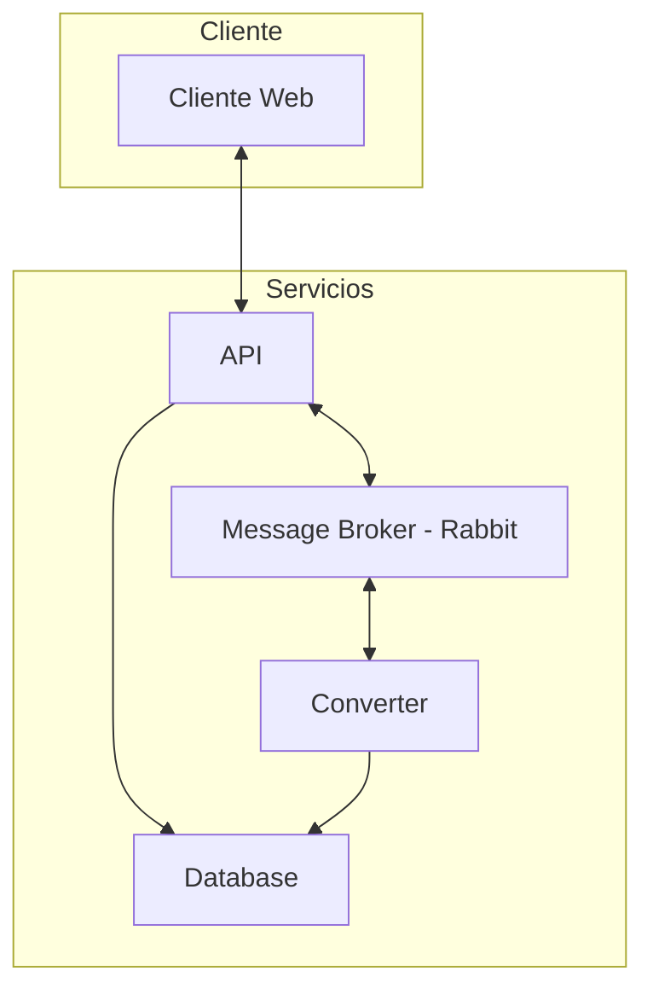
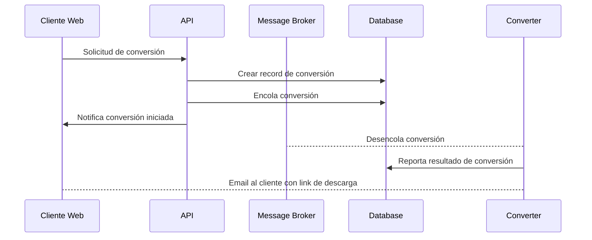

# Aplicación Cloud Convert

Aplicación que convierte archivos entre formatos de audio.

| Nombres   | Apellido   | Correo @uniandes               | Usuario de GitHub |
|-----------|------------|--------------------------------|-------------------|
| Ronald    | Lugo       | r.lugoq@uniandes.edu.co        | [@RonaldLugo]     |
| Alejandro | Santamaría | a.santamaria11@uniandes.edu.co | [@miso-alejosaur] |
| Hector    | Tenezaca   | h.tenezaca@uniandes.edu.co     | [@htenezaca]      |
| Javier    | López Grau | je.lopez816@uniandes.edu.co    | [@muniter]        |

## Objetivo

Validar la autenticación de la plataforma, garantiza la confidencialidad y evita la suplantación con medidas de doble factor.

## Arquitectura

La siguiente es la arquitectura de la aplicación



| Componente     | Propósito |
|----------------|-----------|
| Cliente        |           |
| API            |           |
| Converter      |           |
| Message Broker |           |
| Database       |           |


### Ejemplo de conversión



## Descripción Tecnológica

Se utiliza docker para orquestar el levantamiento de los cuatro componentes.

1. Postgres:
2. Flask:
3. Rabbit MQ:
3. Celery:
4. SqlAlchemy:


## Instrucciones

Requerimientos: docker

Para correr el experimento solo es necesario dos pasos.

1. En un terminal levantar el experimento: `docker compose up --build`

### Health Checks

Para confirmar el funcionamiento de las partes de la app:

```bash
# Cliente Web (En el response se verá el resultado)
curl localhost:8080/api-health
# Converter (Revisar los logs para ver el resultado)
curl localhost:8080/converter-health
# Ping, pong style (mirar los logs)
curl localhost:8080/ping
```

<!-- links, leave at the end, this should be invisible -->
[@RonaldLugo]: https://github.com/RonaldLugo
[@miso-alejosaur]: https://github.com/miso-alejosaur
[@htenezaca]: https://github.com/htenezaca
[@muniter]: https://github.com/muniter
